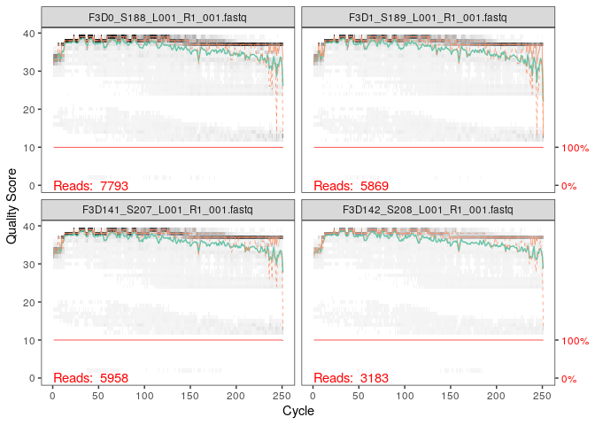
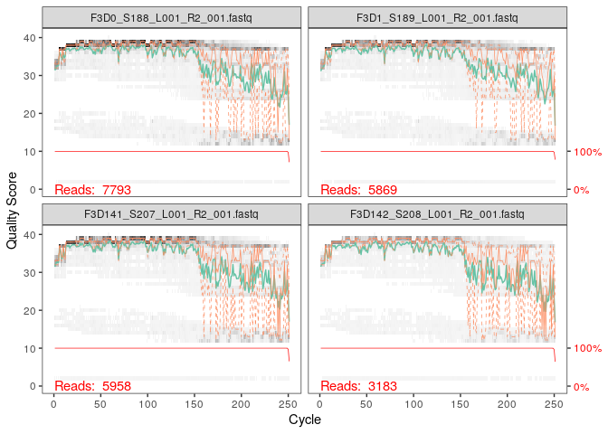

Analyse des donées avec Dada2
================
Vincent Noah
28 novembre 2020

  - [Préparation de l’environnement.](#préparation-de-lenvironnement.)
  - [Inspecter les profils de qualité des
    lectures.](#inspecter-les-profils-de-qualité-des-lectures.)
  - [Filtration et tronquage.](#filtration-et-tronquage.)
  - [Connaître le taux d’erreurs.](#connaître-le-taux-derreurs.)
  - [Inférence d’échantillon](#inférence-déchantillon)
  - [Alignement des R1 et R2 en
    contigs](#alignement-des-r1-et-r2-en-contigs)
  - [Construction de la table
    d’observation](#construction-de-la-table-dobservation)
  - [Distribution des longeurs de
    séquences](#distribution-des-longeurs-de-séquences)
  - [Détection de chimères](#détection-de-chimères)
  - [Pourcentage de séquences chimérique dans l’ensemble de la
    table](#pourcentage-de-séquences-chimérique-dans-lensemble-de-la-table)
  - [Suivre le nombre de séquences enlevées à chaque étape de
    bioinformatique.](#suivre-le-nombre-de-séquences-enlevées-à-chaque-étape-de-bioinformatique.)
  - [Téléchargement des bases de donées et assignation d’un
    taxonomique.](#téléchargement-des-bases-de-donées-et-assignation-dun-taxonomique.)

A partir des instructions
<https://benjjneb.github.io/dada2/tutorial.html>

# Préparation de l’environnement.

On commence par charger le package dada2 pour pouvoir utiliser les
fonctions lors de l’analyse.

``` r
library(Rcpp)
library(dada2)
```

Les données contenues dans Miseq\_SOP sont des séquences d’ARN 16s à
partir d’échantillons d’excréments de souris, obtenu par séquençage
illumina. Miseq\_SOP contient donc les forwards et les reverses. On va
créer un objet path dans lequel on va mettre toutes les données de
Miseq\_SOP. On vérifie par la suite les fichiers contenus dans path avec
la commande list.files

``` r
path <- "~/MiSeq_SOP"
list.files(path)
```

    ##  [1] "F3D0_S188_L001_R1_001.fastq"   "F3D0_S188_L001_R2_001.fastq"  
    ##  [3] "F3D1_S189_L001_R1_001.fastq"   "F3D1_S189_L001_R2_001.fastq"  
    ##  [5] "F3D141_S207_L001_R1_001.fastq" "F3D141_S207_L001_R2_001.fastq"
    ##  [7] "F3D142_S208_L001_R1_001.fastq" "F3D142_S208_L001_R2_001.fastq"
    ##  [9] "F3D143_S209_L001_R1_001.fastq" "F3D143_S209_L001_R2_001.fastq"
    ## [11] "F3D144_S210_L001_R1_001.fastq" "F3D144_S210_L001_R2_001.fastq"
    ## [13] "F3D145_S211_L001_R1_001.fastq" "F3D145_S211_L001_R2_001.fastq"
    ## [15] "F3D146_S212_L001_R1_001.fastq" "F3D146_S212_L001_R2_001.fastq"
    ## [17] "F3D147_S213_L001_R1_001.fastq" "F3D147_S213_L001_R2_001.fastq"
    ## [19] "F3D148_S214_L001_R1_001.fastq" "F3D148_S214_L001_R2_001.fastq"
    ## [21] "F3D149_S215_L001_R1_001.fastq" "F3D149_S215_L001_R2_001.fastq"
    ## [23] "F3D150_S216_L001_R1_001.fastq" "F3D150_S216_L001_R2_001.fastq"
    ## [25] "F3D2_S190_L001_R1_001.fastq"   "F3D2_S190_L001_R2_001.fastq"  
    ## [27] "F3D3_S191_L001_R1_001.fastq"   "F3D3_S191_L001_R2_001.fastq"  
    ## [29] "F3D5_S193_L001_R1_001.fastq"   "F3D5_S193_L001_R2_001.fastq"  
    ## [31] "F3D6_S194_L001_R1_001.fastq"   "F3D6_S194_L001_R2_001.fastq"  
    ## [33] "F3D7_S195_L001_R1_001.fastq"   "F3D7_S195_L001_R2_001.fastq"  
    ## [35] "F3D8_S196_L001_R1_001.fastq"   "F3D8_S196_L001_R2_001.fastq"  
    ## [37] "F3D9_S197_L001_R1_001.fastq"   "F3D9_S197_L001_R2_001.fastq"  
    ## [39] "filtered"                      "HMP_MOCK.v35.fasta"           
    ## [41] "Mock_S280_L001_R1_001.fastq"   "Mock_S280_L001_R2_001.fastq"  
    ## [43] "mouse.dpw.metadata"            "mouse.time.design"            
    ## [45] "stability.batch"               "stability.files"

Une fois que l’on a observé et vérifié le contenu des fichiers dans
path, on peut trier ces fichiers dans différents objets pour permettre
l’analyse. On va donc créer l’objet fnFs qui contiendra tous les
forwards, en indiquant à R de mettre tous les fichiers contenant le
format *R1\_001.fastq dans fnFs tout en gardant le nom entier des
fichiers avec la commande full.name= TRUE. On réitère les mêmes
opérations pour les Reverses (R2) avec l’objet fnRs. Afin de faciliter
l’analyse et pour ne pas avoir des noms trop longs, on va “simplifier”
les noms des fichiers fnFs avec la commande sapply en précisant à R que
l’on veut enlever toutes les chaines de caractères (strsplit) après le
"*", puis on va mettre ces noms simplifiés dans un nouvel objet appelé
sample.name

``` r
fnFs <- sort(list.files(path, pattern="_R1_001.fastq", full.names = TRUE))
fnRs <- sort(list.files(path, pattern="_R2_001.fastq", full.names = TRUE))
# Extract sample names, assuming filenames have format: SAMPLENAME_XXX.fastq
sample.names <- sapply(strsplit(basename(fnFs), "_"), `[`, 1)
```

# Inspecter les profils de qualité des lectures.

Une fois l’environnement préparé, on va maintenant inspecter les scores
de qualité des FnFs, en traçant un graphique (plot) comprenant les
fichiers fnFs 1 à 4. Ce graphique va nous permettre de visualiser les
pertes significatives de qualité, et donc nous permettre de savoir sur
quel nucléotide ou va pouvoir “couper” pour obtenir des séquences plus
nettes.

  - En gris on a la heat map (carte de fréquentation) qui représente la
    fréquence de chaque score de qualité à chaque position de base.

  - Le score de qualité moyen est indiqué en vert.

  - Le quartile de la distribution du score de qualité est indiqué en
    orange.

  - Globalement les scores de qualité des Forward rads sont plutôt bons.
    Cependant la qualité vers la fin. La baisse du score de qualité est
    un phénomène normal que l’on retrouve avec le séquençage illumina.
    On va donc éliminer les résultats à partir de la position 260.

<!-- end list -->

``` r
plotQualityProfile(fnFs[1:4])
```

<!-- -->

  - Ici c’est le même principe, sauf que l’on observe les scores de
    qualité des fichiers 1 à 4 des R2.

  - Les Reverse reads possède un score de qualité nettement inférieur
    par rapport au forward reads. C’est un phénomène courant lors du
    séquençage illumina. En effet, à la position 160 on observe une
    chute de la qualité. Il faudra donc éliminer les données à partir de
    la position 160.

<!-- end list -->

``` r
plotQualityProfile(fnRs[1:4])
```

<!-- -->

# Filtration et tronquage.

On commence par créer deux fichiers (filtFs et filrRs) où on va
regrouper les fichiers fasq, une fois qu’ils seront filtrés, en
utilisant les noms simplifiés.

``` r
filtFs <- file.path(path, "filtered", paste0(sample.names, "_F_filt.fastq.gz"))
filtRs <- file.path(path, "filtered", paste0(sample.names, "_R_filt.fastq.gz"))
names(filtFs) <- sample.names
names(filtRs) <- sample.names
```

Afin de filtrer les données, on va utiliser une fonction de Dada2
“filterAndTrim”. On va donc indiquer à R les fichiers concernés (fnFs,
filFs, fnRs, filtRs) et indiquer ce que l’on veut tronquer, avec
trunccLen=c(240,160). On va donc tronquer à partir de la position 240
(pb) pour les fnFs, et 160 pour les fnRs. Les autres paramètres sont des
paramètres de filtration par défaut, autorisant le nombre d’erreurs
maximale à 2. Pour voir le résultat on va utiliser head, qui va nous
permettre de visualiser seulement le premier fichier de la liste,
contrairement au print qui aurait tout affiché et aurait demandé
beaucoup plus de ressources. R nous donnera le nombre de résultats avant
et après filtration.

``` r
out <- filterAndTrim(fnFs, filtFs, fnRs, filtRs, truncLen=c(240,160),
              maxN=0, maxEE=c(2,2), truncQ=2, rm.phix=TRUE,
              compress=TRUE, multithread=TRUE) # On Windows set multithread=FALSE
head(out)
```

    ##                               reads.in reads.out
    ## F3D0_S188_L001_R1_001.fastq       7793      7113
    ## F3D1_S189_L001_R1_001.fastq       5869      5299
    ## F3D141_S207_L001_R1_001.fastq     5958      5463
    ## F3D142_S208_L001_R1_001.fastq     3183      2914
    ## F3D143_S209_L001_R1_001.fastq     3178      2941
    ## F3D144_S210_L001_R1_001.fastq     4827      4312

# Connaître le taux d’erreurs.

Dada2 à partir de la fonction learnErrors calcul un modèle d’erreur.
Pour cela Dada2 va utiliser nos données de nos séquences et en déduire
s’il y a eu des erreurs dans la lecture des bases. Dans cette fonction
learnErrors, on précise que l’on l’applique sur le fichier filtFs, et
l’argument multithread=TRUE permet d’exécuter plusieurs tâches
efficacement. Ici on a le modèle basé sur 139642 lectures issues de 20
échantillons.

``` r
errF <- learnErrors(filtFs, multithread=TRUE)
```

    ## 33514080 total bases in 139642 reads from 20 samples will be used for learning the error rates.

On réitère la même opération pour les Reverse.

``` r
errR <- learnErrors(filtRs, multithread=TRUE)
```

    ## 22342720 total bases in 139642 reads from 20 samples will be used for learning the error rates.

On peut maintenant visualiser le taux d’erreurs estimés (ici des
forward) en rentrant la fonction plotErrors. Si on prend l’exemple de
A2T, cela montre le taux d’erreur de A en T.

  - La ligne noire montre le taux d’erreurs estimé avec learnErrors.

  - La ligne en rouge montre le taux d’erreur observé.

  - On observe qu’il y a peu de différence.

<!-- end list -->

``` r
plotErrors(errF, nominalQ=TRUE)
```

    ## Warning: Transformation introduced infinite values in continuous y-axis
    
    ## Warning: Transformation introduced infinite values in continuous y-axis

<!-- -->

# Inférence d’échantillon

Le package Dada2 contient un algorithme d’interférence aux données que
nous venons juste de filtrer et de tronquer. Cela nous permet d’enlever
les bruits de fond, pour les R1 et les R2.

``` r
dadaFs <- dada(filtFs, err=errF, multithread=TRUE)
```

    ## Sample 1 - 7113 reads in 1979 unique sequences.
    ## Sample 2 - 5299 reads in 1639 unique sequences.
    ## Sample 3 - 5463 reads in 1477 unique sequences.
    ## Sample 4 - 2914 reads in 904 unique sequences.
    ## Sample 5 - 2941 reads in 939 unique sequences.
    ## Sample 6 - 4312 reads in 1267 unique sequences.
    ## Sample 7 - 6741 reads in 1756 unique sequences.
    ## Sample 8 - 4560 reads in 1438 unique sequences.
    ## Sample 9 - 15637 reads in 3590 unique sequences.
    ## Sample 10 - 11413 reads in 2762 unique sequences.
    ## Sample 11 - 12017 reads in 3021 unique sequences.
    ## Sample 12 - 5032 reads in 1566 unique sequences.
    ## Sample 13 - 18075 reads in 3707 unique sequences.
    ## Sample 14 - 6250 reads in 1479 unique sequences.
    ## Sample 15 - 4052 reads in 1195 unique sequences.
    ## Sample 16 - 7369 reads in 1832 unique sequences.
    ## Sample 17 - 4765 reads in 1183 unique sequences.
    ## Sample 18 - 4871 reads in 1382 unique sequences.
    ## Sample 19 - 6504 reads in 1709 unique sequences.
    ## Sample 20 - 4314 reads in 897 unique sequences.

``` r
dadaRs <- dada(filtRs, err=errR, multithread=TRUE)
```

    ## Sample 1 - 7113 reads in 1660 unique sequences.
    ## Sample 2 - 5299 reads in 1349 unique sequences.
    ## Sample 3 - 5463 reads in 1335 unique sequences.
    ## Sample 4 - 2914 reads in 853 unique sequences.
    ## Sample 5 - 2941 reads in 880 unique sequences.
    ## Sample 6 - 4312 reads in 1286 unique sequences.
    ## Sample 7 - 6741 reads in 1803 unique sequences.
    ## Sample 8 - 4560 reads in 1265 unique sequences.
    ## Sample 9 - 15637 reads in 3414 unique sequences.
    ## Sample 10 - 11413 reads in 2522 unique sequences.
    ## Sample 11 - 12017 reads in 2771 unique sequences.
    ## Sample 12 - 5032 reads in 1415 unique sequences.
    ## Sample 13 - 18075 reads in 3290 unique sequences.
    ## Sample 14 - 6250 reads in 1390 unique sequences.
    ## Sample 15 - 4052 reads in 1134 unique sequences.
    ## Sample 16 - 7369 reads in 1635 unique sequences.
    ## Sample 17 - 4765 reads in 1084 unique sequences.
    ## Sample 18 - 4871 reads in 1161 unique sequences.
    ## Sample 19 - 6504 reads in 1502 unique sequences.
    ## Sample 20 - 4314 reads in 732 unique sequences.

Permet d’inspecter ce qu’il y a dans la première “case” de l’objet
dadaFs.

``` r
dadaFs[[1]]
```

    ## dada-class: object describing DADA2 denoising results
    ## 128 sequence variants were inferred from 1979 input unique sequences.
    ## Key parameters: OMEGA_A = 1e-40, OMEGA_C = 1e-40, BAND_SIZE = 16

# Alignement des R1 et R2 en contigs

Grâce à la fonction mergerPair, on va pouvoir maintenant aligner les R1
et R2 pour former des contigs. Dans les arguments de cette fonction on
précise que l’on utilise les fichiers filtrés et tronqués. On va stoquer
ces données dans un nouvel objet mergers. La sortie, nous montre les
séquences qui ont pu être alignées en contigs par rapport à l’ensemble
des séquences.

``` r
mergers <- mergePairs(dadaFs, filtFs, dadaRs, filtRs, verbose=TRUE)
```

    ## 6551 paired-reads (in 106 unique pairings) successfully merged out of 6907 (in 199 pairings) input.

    ## 5025 paired-reads (in 100 unique pairings) successfully merged out of 5188 (in 156 pairings) input.

    ## 4973 paired-reads (in 80 unique pairings) successfully merged out of 5268 (in 166 pairings) input.

    ## 2595 paired-reads (in 52 unique pairings) successfully merged out of 2756 (in 109 pairings) input.

    ## 2553 paired-reads (in 60 unique pairings) successfully merged out of 2785 (in 119 pairings) input.

    ## 3622 paired-reads (in 53 unique pairings) successfully merged out of 4103 (in 157 pairings) input.

    ## 6079 paired-reads (in 81 unique pairings) successfully merged out of 6515 (in 198 pairings) input.

    ## 3961 paired-reads (in 90 unique pairings) successfully merged out of 4384 (in 188 pairings) input.

    ## 14231 paired-reads (in 143 unique pairings) successfully merged out of 15358 (in 351 pairings) input.

    ## 10526 paired-reads (in 120 unique pairings) successfully merged out of 11166 (in 279 pairings) input.

    ## 11156 paired-reads (in 137 unique pairings) successfully merged out of 11799 (in 298 pairings) input.

    ## 4329 paired-reads (in 84 unique pairings) successfully merged out of 4788 (in 180 pairings) input.

    ## 17431 paired-reads (in 153 unique pairings) successfully merged out of 17812 (in 272 pairings) input.

    ## 5850 paired-reads (in 81 unique pairings) successfully merged out of 6095 (in 159 pairings) input.

    ## 3716 paired-reads (in 86 unique pairings) successfully merged out of 3894 (in 147 pairings) input.

    ## 6865 paired-reads (in 99 unique pairings) successfully merged out of 7193 (in 187 pairings) input.

    ## 4430 paired-reads (in 67 unique pairings) successfully merged out of 4605 (in 127 pairings) input.

    ## 4574 paired-reads (in 100 unique pairings) successfully merged out of 4736 (in 172 pairings) input.

    ## 6094 paired-reads (in 109 unique pairings) successfully merged out of 6314 (in 172 pairings) input.

    ## 4269 paired-reads (in 20 unique pairings) successfully merged out of 4281 (in 28 pairings) input.

``` r
# Inspect the merger data.frame from the first sample
head(mergers[[1]])
```

    ##                                                                                                                                                                                                                                                       sequence
    ## 1 TACGGAGGATGCGAGCGTTATCCGGATTTATTGGGTTTAAAGGGTGCGCAGGCGGAAGATCAAGTCAGCGGTAAAATTGAGAGGCTCAACCTCTTCGAGCCGTTGAAACTGGTTTTCTTGAGTGAGCGAGAAGTATGCGGAATGCGTGGTGTAGCGGTGAAATGCATAGATATCACGCAGAACTCCGATTGCGAAGGCAGCATACCGGCGCTCAACTGACGCTCATGCACGAAAGTGTGGGTATCGAACAGG
    ## 2 TACGGAGGATGCGAGCGTTATCCGGATTTATTGGGTTTAAAGGGTGCGTAGGCGGCCTGCCAAGTCAGCGGTAAAATTGCGGGGCTCAACCCCGTACAGCCGTTGAAACTGCCGGGCTCGAGTGGGCGAGAAGTATGCGGAATGCGTGGTGTAGCGGTGAAATGCATAGATATCACGCAGAACCCCGATTGCGAAGGCAGCATACCGGCGCCCTACTGACGCTGAGGCACGAAAGTGCGGGGATCAAACAGG
    ## 3 TACGGAGGATGCGAGCGTTATCCGGATTTATTGGGTTTAAAGGGTGCGTAGGCGGGCTGTTAAGTCAGCGGTCAAATGTCGGGGCTCAACCCCGGCCTGCCGTTGAAACTGGCGGCCTCGAGTGGGCGAGAAGTATGCGGAATGCGTGGTGTAGCGGTGAAATGCATAGATATCACGCAGAACTCCGATTGCGAAGGCAGCATACCGGCGCCCGACTGACGCTGAGGCACGAAAGCGTGGGTATCGAACAGG
    ## 4 TACGGAGGATGCGAGCGTTATCCGGATTTATTGGGTTTAAAGGGTGCGTAGGCGGGCTTTTAAGTCAGCGGTAAAAATTCGGGGCTCAACCCCGTCCGGCCGTTGAAACTGGGGGCCTTGAGTGGGCGAGAAGAAGGCGGAATGCGTGGTGTAGCGGTGAAATGCATAGATATCACGCAGAACCCCGATTGCGAAGGCAGCCTTCCGGCGCCCTACTGACGCTGAGGCACGAAAGTGCGGGGATCGAACAGG
    ## 5 TACGGAGGATGCGAGCGTTATCCGGATTTATTGGGTTTAAAGGGTGCGCAGGCGGACTCTCAAGTCAGCGGTCAAATCGCGGGGCTCAACCCCGTTCCGCCGTTGAAACTGGGAGCCTTGAGTGCGCGAGAAGTAGGCGGAATGCGTGGTGTAGCGGTGAAATGCATAGATATCACGCAGAACTCCGATTGCGAAGGCAGCCTACCGGCGCGCAACTGACGCTCATGCACGAAAGCGTGGGTATCGAACAGG
    ## 6 TACGGAGGATGCGAGCGTTATCCGGATTTATTGGGTTTAAAGGGTGCGTAGGCGGGATGCCAAGTCAGCGGTAAAAAAGCGGTGCTCAACGCCGTCGAGCCGTTGAAACTGGCGTTCTTGAGTGGGCGAGAAGTATGCGGAATGCGTGGTGTAGCGGTGAAATGCATAGATATCACGCAGAACTCCGATTGCGAAGGCAGCATACCGGCGCCCTACTGACGCTGAGGCACGAAAGCGTGGGTATCGAACAGG
    ##   abundance forward reverse nmatch nmismatch nindel prefer accept
    ## 1       579       1       1    148         0      0      1   TRUE
    ## 2       470       2       2    148         0      0      2   TRUE
    ## 3       449       3       4    148         0      0      1   TRUE
    ## 4       430       4       3    148         0      0      2   TRUE
    ## 5       345       5       6    148         0      0      1   TRUE
    ## 6       282       6       5    148         0      0      2   TRUE

# Construction de la table d’observation

On va maintenant créer une table de séquences grâce à la fonction
“makeSequenceTable” à partir des contigs obtenus est placé dans
l’objet mergers.

``` r
seqtab <- makeSequenceTable(mergers)
dim(seqtab)
```

    ## [1]  20 293

# Distribution des longeurs de séquences

On peut maintenant savoir la taille de nos séquences. On va préciser à R
avec “getSequences” de sélectionner les séquences de contenu dans
seqtab. L’argument nchar, nous permet de connaitre la taille de chaque
séquence. Par exemple, ici on retrouve 1 séquence unique d’une longueur
de 251 pb.

``` r
# Inspect distribution of sequence lengths
table(nchar(getSequences(seqtab)))
```

    ## 
    ## 251 252 253 254 255 
    ##   1  88 196   6   2

# Détection de chimères

Pour une meilleure analyse, il faut détecter et supprimer les chimères.
Ce sont des chevauchements qui vont fausser les lectures. Avec la
fonction removeBimeraDenovo, on va enlever ces chevauchements dans
seqtabs. Une fois les chimères enlevées, on va stoquer les données dans
un nouvel objet seqtab.nochim

dim (seqtab.nochim) nous permet de donner la dimention de seqtab.nochim

  - On observe qu’il y a eu 61 chimères retirées sur 293 séquences.

<!-- end list -->

``` r
seqtab.nochim <- removeBimeraDenovo(seqtab, method="consensus", multithread=TRUE, verbose=TRUE)
```

    ## Identified 61 bimeras out of 293 input sequences.

``` r
dim(seqtab.nochim)
```

    ## [1]  20 232

# Pourcentage de séquences chimérique dans l’ensemble de la table

On peut déterminer le pourcentage du taux de chimères. Cela est plus
représentatif. Pour cela on va diviser la somme (sum) des séquences
contenues dans seqtab.nochim (sans chimère) et la somme des seqtab (avec
chimères). On retranche 1 au résultat ce qui va nous permettre de
connaitre le pourcentage de séquences chimériques. On trouve qu’il y a
3.5% de séquences chimérique dans notre jeu de donnée.

``` r
1-sum(seqtab.nochim)/sum(seqtab)
```

    ## [1] 0.03573702

# Suivre le nombre de séquences enlevées à chaque étape de bioinformatique.

On peut suivre l’évolution du nombre de séquences, dans les différents
échantillons au fur et à mesure de nos différentes interventions comme
le filtrage ou le tronquage.

  - La fonctions getUnique permet d’extraire des séquences uniques des
    jeu de données voulus. Cette fonction est associé à getN.

  - On applique cette fonction à dadaFs, dadaRs, mergers et
    seqtab.nochim

  - Out nous permet d’avoir que les sorties.

<!-- end list -->

``` r
getN <- function(x) sum(getUniques(x))
track <- cbind(out, sapply(dadaFs, getN), sapply(dadaRs, getN), sapply(mergers, getN), rowSums(seqtab.nochim))
# If processing a single sample, remove the sapply calls: e.g. replace sapply(dadaFs, getN) with getN(dadaFs)
colnames(track) <- c("input", "filtered", "denoisedF", "denoisedR", "merged", "nonchim")
rownames(track) <- sample.names
print(track)
```

    ##        input filtered denoisedF denoisedR merged nonchim
    ## F3D0    7793     7113      6996      6978   6551    6539
    ## F3D1    5869     5299      5227      5239   5025    5014
    ## F3D141  5958     5463      5339      5351   4973    4850
    ## F3D142  3183     2914      2799      2833   2595    2521
    ## F3D143  3178     2941      2822      2868   2553    2519
    ## F3D144  4827     4312      4146      4224   3622    3483
    ## F3D145  7377     6741      6593      6628   6079    5820
    ## F3D146  5021     4560      4448      4466   3961    3872
    ## F3D147 17070    15637     15437     15507  14231   13004
    ## F3D148 12405    11413     11251     11268  10526    9938
    ## F3D149 13083    12017     11858     11899  11156   10653
    ## F3D150  5509     5032      4863      4928   4329    4248
    ## F3D2   19620    18075     17907     17939  17431   16835
    ## F3D3    6758     6250      6145      6176   5850    5486
    ## F3D5    4448     4052      3930      3994   3716    3716
    ## F3D6    7989     7369      7236      7295   6865    6678
    ## F3D7    5129     4765      4648      4671   4430    4219
    ## F3D8    5294     4871      4784      4799   4574    4545
    ## F3D9    7070     6504      6341      6442   6094    6017
    ## Mock    4779     4314      4287      4286   4269    4269

``` r
getN <- function(x) sum(getUniques(x))
track <- cbind(out, sapply(dadaFs, getN), sapply(dadaRs, getN), sapply(mergers, getN), rowSums(seqtab.nochim))
# If processing a single sample, remove the sapply calls: e.g. replace sapply(dadaFs, getN) with getN(dadaFs)
colnames(track) <- c("input", "filtered", "denoisedF", "denoisedR", "merged", "nonchim")
rownames(track) <- sample.names
head(track)
```

    ##        input filtered denoisedF denoisedR merged nonchim
    ## F3D0    7793     7113      6996      6978   6551    6539
    ## F3D1    5869     5299      5227      5239   5025    5014
    ## F3D141  5958     5463      5339      5351   4973    4850
    ## F3D142  3183     2914      2799      2833   2595    2521
    ## F3D143  3178     2941      2822      2868   2553    2519
    ## F3D144  4827     4312      4146      4224   3622    3483

# Téléchargement des bases de donées et assignation d’un taxonomique.

De par le bash, on peut télécharger directement des données à partir
d’un lien,avec wget. ici il sagit de données
(silva\_nr99\_v138\_train\_set.fa.gz ) qui permettre d’attribuer des
taxons, afin de determiner la diversité présente dans nos échantillons.

``` bash
wget https://zenodo.org/record/3986799/files/silva_nr99_v138_train_set.fa.gz
```

On peut donc ensuite grâce a la fonction de Dada2 “assignTaxonomy()”
assigner des taxons, en précisant à R que, dans un nouvel objet “taxa”,
et à partir des séquences de seqtab.nochim, d’assigner des taxons.

``` r
taxa <- assignTaxonomy(seqtab.nochim, "~/silva_nr99_v138_train_set.fa.gz", multithread=TRUE)
```

On peut maintenant observer nos résultats.

``` r
taxa.print <- taxa # Removing sequence rownames for display only
rownames(taxa.print) <- NULL
head(taxa.print)
```

    ##      Kingdom    Phylum         Class         Order           Family          
    ## [1,] "Bacteria" "Bacteroidota" "Bacteroidia" "Bacteroidales" "Muribaculaceae"
    ## [2,] "Bacteria" "Bacteroidota" "Bacteroidia" "Bacteroidales" "Muribaculaceae"
    ## [3,] "Bacteria" "Bacteroidota" "Bacteroidia" "Bacteroidales" "Muribaculaceae"
    ## [4,] "Bacteria" "Bacteroidota" "Bacteroidia" "Bacteroidales" "Muribaculaceae"
    ## [5,] "Bacteria" "Bacteroidota" "Bacteroidia" "Bacteroidales" "Bacteroidaceae"
    ## [6,] "Bacteria" "Bacteroidota" "Bacteroidia" "Bacteroidales" "Muribaculaceae"
    ##      Genus        
    ## [1,] NA           
    ## [2,] NA           
    ## [3,] NA           
    ## [4,] NA           
    ## [5,] "Bacteroides"
    ## [6,] NA

On réitère la même opération. La différence cette fois-ci c’est que l’on
télécharge des données pour l’assignation taxonomique, qui permettent
d’avoir en plus le nom des espèces. Cela nous donne donc une
information supplémentaire.

``` bash
wget https://zenodo.org/record/3986799/files/silva_species_assignment_v138.fa.gz
```

``` r
taxa <- addSpecies(taxa, "~/silva_species_assignment_v138.fa.gz")
```

``` r
taxa.print <- taxa # Removing sequence rownames for display only
rownames(taxa.print) <- NULL
head(taxa.print)
```

    ##      Kingdom    Phylum         Class         Order           Family          
    ## [1,] "Bacteria" "Bacteroidota" "Bacteroidia" "Bacteroidales" "Muribaculaceae"
    ## [2,] "Bacteria" "Bacteroidota" "Bacteroidia" "Bacteroidales" "Muribaculaceae"
    ## [3,] "Bacteria" "Bacteroidota" "Bacteroidia" "Bacteroidales" "Muribaculaceae"
    ## [4,] "Bacteria" "Bacteroidota" "Bacteroidia" "Bacteroidales" "Muribaculaceae"
    ## [5,] "Bacteria" "Bacteroidota" "Bacteroidia" "Bacteroidales" "Bacteroidaceae"
    ## [6,] "Bacteria" "Bacteroidota" "Bacteroidia" "Bacteroidales" "Muribaculaceae"
    ##      Genus         Species
    ## [1,] NA            NA     
    ## [2,] NA            NA     
    ## [3,] NA            NA     
    ## [4,] NA            NA     
    ## [5,] "Bacteroides" NA     
    ## [6,] NA            NA

\#Evaluation de la précision

  - Mock est une communauté qui contient 20 souches connues déjà
    séquencées. C’est donc un témoin.

  - Cette étape nous permet de vérifier l’exactitude des étapes appliqué
    par Dada2 sur nos échantillons, pour déterminer s’il existe un taux
    d’erreurs.

  - Pour cela, on va vérifier si Dada2 peut retrouver le nombre de
    souches contenue dans la communauté mock. On retrouve bien 20.

<!-- end list -->

``` r
unqs.mock <- seqtab.nochim["Mock",]
unqs.mock <- sort(unqs.mock[unqs.mock>0], decreasing=TRUE) # Drop ASVs absent in the Mock
cat("DADA2 inferred", length(unqs.mock), "sample sequences present in the Mock community.\n")
```

    ## DADA2 inferred 20 sample sequences present in the Mock community.

  - On recompare aux données que Dada2 était supposé trouver en allant
    les récupérer dans le fichier HMP\_MOCK.v35.fasta. On retrouve bien
    20.

<!-- end list -->

``` r
mock.ref <- getSequences(file.path(path, "HMP_MOCK.v35.fasta"))
match.ref <- sum(sapply(names(unqs.mock), function(x) any(grepl(x, mock.ref))))
cat("Of those,", sum(match.ref), "were exact matches to the expected reference sequences.\n")
```

    ## Of those, 20 were exact matches to the expected reference sequences.

Afin de pouvoir continuer notre analyse avec phyloseq, On va réaliser
une sauvegarde, que l’on pourra charger avant l’analyse de phyloseq afin
d’avoir toutes les données.

``` r
save.image(file="02_data-analysis-with-DADA2_FinalEnv")
```
