Analyse statistique avec Phyloseq
================
Vincent Noah
30 novembre 2020

  - [Chargement de packages
    nécessaires.](#chargement-de-packages-nécessaires.)
      - [Construction du data.frame](#construction-du-data.frame)
  - [Construction de l’arbre (phyloseq) à partir des données de
    Dada2.](#construction-de-larbre-phyloseq-à-partir-des-données-de-dada2.)
  - [Création de l’objet phyloseq.](#création-de-lobjet-phyloseq.)
      - [Basé sur le tutoriel DADA2.](#basé-sur-le-tutoriel-dada2.)
  - [Visualisation de
    l’alpha-diversité.](#visualisation-de-lalpha-diversité.)
  - [Ordination.](#ordination.)
      - [Pour obtenir un graphique en
        bar.](#pour-obtenir-un-graphique-en-bar.)
  - [Création de l’objet phyloseq.](#création-de-lobjet-phyloseq.-1)
      - [Basé sur le tutoriel
        phyloseq.](#basé-sur-le-tutoriel-phyloseq.)
  - [Filtration.](#filtration.)
      - [Filtration taxonomique.](#filtration-taxonomique.)
  - [Observation de la prévalence.](#observation-de-la-prévalence.)
  - [Filtrage de la prévalence.](#filtrage-de-la-prévalence.)
  - [Taxons agglomérés.](#taxons-agglomérés.)
  - [Transformation de la valeur
    d’abondance.](#transformation-de-la-valeur-dabondance.)
  - [Sous-ensemble par taxonomie.](#sous-ensemble-par-taxonomie.)
  - [Prétraitement.](#prétraitement.)
  - [Différentes projections
    d’ordination.](#différentes-projections-dordination.)
  - [Pourquoi les tracés d’ordination sont-ils si éloignés
    ?](#pourquoi-les-tracés-dordination-sont-ils-si-éloignés)
      - [PCA sur les rangs.](#pca-sur-les-rangs.)
  - [Enseignement supervisé.](#enseignement-supervisé.)
  - [Analyses basées sur des
    graphiques.](#analyses-basées-sur-des-graphiques.)
      - [Créer et tracer des
        graphiques.](#créer-et-tracer-des-graphiques.)
      - [Tests à deux échantillons basés sur des
        graphiques.](#tests-à-deux-échantillons-basés-sur-des-graphiques.)
      - [Arbre couvrant minimum (MST)](#arbre-couvrant-minimum-mst)
  - [Modélisation linéaire.](#modélisation-linéaire.)
  - [Tests multiples hiérarchiques.](#tests-multiples-hiérarchiques.)
  - [Techniques polyvalentes.](#techniques-polyvalentes.)
  - [Conclusion](#conclusion)

A partir du tutoriel phyloseq :
<https://bioconductor.org/help/course-materials/2017/BioC2017/Day1/Workshops/Microbiome/MicrobiomeWorkflowII.html>

# Chargement de packages nécessaires.

Le package Biostrings permet de pouvoir travailler sur des chaines de
caractères d’origine biologique. C’est par exemple de cas de l’ADN.
Quant au package ggplot2, il sera indispensable pour réaliser des
graphiques. Le package phyloseq nous permettra de réaliser les analyses.

``` r
library(phyloseq)
library(Biostrings)
library(ggplot2)
```

## Construction du data.frame

Pour réaliser notre analyse, il faut préparer l’environnement.

Pour cela, il faut charger la sauvegarde que l’on avait réalisée
précédemment, car les données de l’analyse avec dada2 sont
nécessaires.

Ces données seront insérées dans des nouveaux objets avec des noms qui
simplifieront l’analyse.

``` r
library(Rcpp)
library(dada2)
load("02_data-analysis-with-DADA2_FinalEnv")
samples.out <- rownames(seqtab.nochim)
subject <- sapply(strsplit(samples.out, "D"), `[`, 1)
gender <- substr(subject,1,1)
subject <- substr(subject,2,999)
day <- as.integer(sapply(strsplit(samples.out, "D"), `[`, 2))
samdf <- data.frame(Subject=subject, Gender=gender, Day=day)
samdf$When <- "Early"
samdf$When[samdf$Day>100] <- "Late"
rownames(samdf) <- samples.out
```

# Construction de l’arbre (phyloseq) à partir des données de Dada2.

``` r
library(phangorn)
```

    ## Loading required package: ape

    ## 
    ## Attaching package: 'ape'

    ## The following object is masked from 'package:Biostrings':
    ## 
    ##     complement

``` r
library(DECIPHER)
```

    ## Loading required package: RSQLite

``` r
seqs <- getSequences(seqtab.nochim)
names(seqs) <- seqs # This propagates to the tip labels of the tree
alignment <- AlignSeqs(DNAStringSet(seqs), anchor=NA,verbose=FALSE)
phangAlign <- phyDat(as(alignment, "matrix"), type="DNA")
dm <- dist.ml(phangAlign)
treeNJ <- NJ(dm) # Note, tip order != sequence order
fit = pml(treeNJ, data=phangAlign)
```

    ## negative edges length changed to 0!

``` r
fitGTR <- update(fit, k=4, inv=0.2)
fitGTR <- optim.pml(fitGTR, model="GTR", optInv=TRUE, optGamma=TRUE,
        rearrangement = "stochastic", control = pml.control(trace = 0))
detach("package:phangorn", unload=TRUE)
```

# Création de l’objet phyloseq.

Pour réaliser des analyses avec phyloseq, on va créer un objet qui ne se
nomme ps. Il contient les analyses de Dada2. Cependant il faut retirer
les données contenues dans Mock avec l’écriture “\!=”. En effet les
données contenues dans mock étaient les données qui nous permettaient
de vérifier la précision de l’analyse réalisée avec Dada2.

## Basé sur le tutoriel DADA2.

``` r
ps <- phyloseq(otu_table(seqtab.nochim, taxa_are_rows=FALSE), 
               sample_data(samdf), 
               tax_table(taxa))
ps <- prune_samples(sample_names(ps) != "Mock", ps) # Remove mock sample
```

``` r
dna <- Biostrings::DNAStringSet(taxa_names(ps))
names(dna) <- taxa_names(ps)
ps <- merge_phyloseq(ps, dna)
taxa_names(ps) <- paste0("ASV", seq(ntaxa(ps)))
ps
```

# Visualisation de l’alpha-diversité.

On peut par exemple visualiser l’alpha diversité. Pour cela on utilise
la fonction “plot\_richness” qui permet de crée un graphique
représentant la diversité. Cependant on doit rentrer des arguments dans
cette fonction.

  - Utiliser les données de l’objet ps.

  - Avoir les jours en abscisse.

  - en abscisse les valeurs de l’alpha diversité

  - Une couleur différente pour savoir quand a été prélevée les
    échantillons dans la journée.

  - Et les indices d’alpha diversité. Ici on utilise l’indice de Shannon
    et celui de Simpson.

L’indice de Shannon reflète aussi bien le nombre d’espèces que leur
abondance. Cela nous permet de savoir la réparation des espèces au sein
d’une communauté. L’indice de Simpson mesure la probabilité que deux
individus sélectionnés au hasard appartiennent à la même espèce. Cela
nous informe sur la domination d’une ou plusieurs espèces au sein d’une
communauté.

On n’observe pas de différences significative dans l’alpha diversité en
fonction du moment de la journée.

``` r
plot_richness(ps, x="Day", measures=c("Shannon", "Simpson"), color="When")
```

    ## Warning in estimate_richness(physeq, split = TRUE, measures = measures): The data you have provided does not have
    ## any singletons. This is highly suspicious. Results of richness
    ## estimates (for example) are probably unreliable, or wrong, if you have already
    ## trimmed low-abundance taxa from the data.
    ## 
    ## We recommended that you find the un-trimmed data and retry.

<!-- -->

# Ordination.

La fonction “transform\_sample” permet d’observer l’abondance relative.
Ici on utilise l’indice de Bray-Curtis pour cette fonction d’ordination.

  - On utilise l’objet ps

  - NMDS signifie non metric multidimentional scaling

  - On va mettre ces données dans un nouvel objet ps.prop

<!-- end list -->

``` r
ps.prop <- transform_sample_counts(ps, function(otu) otu/sum(otu))
ord.nmds.bray <- ordinate(ps.prop, method="NMDS", distance="bray")
```

On va maintenant utiliser les données que l’on vient de générer dans
l’objet ps.prop et de les visualiser graphiquement avec la fonction
plot\_ordination. On observe qu’il y a séparation distincte entre les
échantillons Early et Late.

``` r
plot_ordination(ps.prop, ord.nmds.bray, color="When", title="Bray NMDS")
```

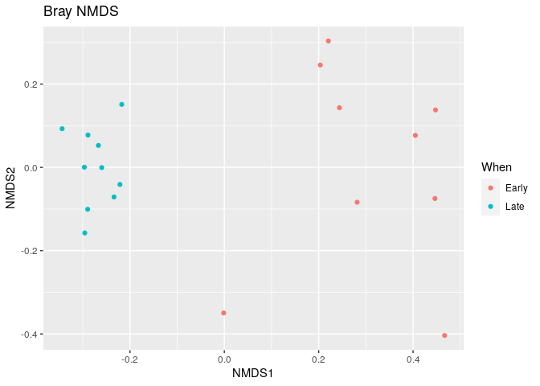<!-- -->

## Pour obtenir un graphique en bar.

  - names(sort(taxa\_sums(ps), decreasing=TRUE))\[1:20\] Permet de dire
    à R que l’on veut les 20 taxonomies les plus abondantes. Ces
    données vont être placées dans un nouvel objet que l’on va appeler
    top20.

  - On réitère l’opération avec l’objet ps en créant l’objet ps.top20

  - Avec la fonction plot\_bar on va réaliser un graphique en bar des
    OTU les plus abondantes où en abscisse on va retrouver le temps (sur
    une journée) et que l’on s’intéresse qu’à la famille.

<!-- end list -->

``` r
top20 <- names(sort(taxa_sums(ps), decreasing=TRUE))[1:20]
ps.top20 <- transform_sample_counts(ps, function(OTU) OTU/sum(OTU))
ps.top20 <- prune_taxa(top20, ps.top20)
plot_bar(ps.top20, x="Day", fill="Family") + facet_wrap(~When, scales="free_x")
```

<!-- -->

# Création de l’objet phyloseq.

## Basé sur le tutoriel phyloseq.

Pour continuer on va générer un autre objet phyloseq, qui contient des
informations complémentaires qui nous seront indispensables, pour les
analyses avec Phyloseq.

``` r
ps_connect <-url("https://raw.githubusercontent.com/spholmes/F1000_workflow/master/data/ps.rds")
ps = readRDS(ps_connect)
ps
```

# Filtration.

## Filtration taxonomique.

Avant de commencer, on détermine nos différents rangs taxonomiques.

``` r
rank_names(ps)
```

    ## [1] "Kingdom" "Phylum"  "Class"   "Order"   "Family"  "Genus"

On va maintenant créer une table à partir du phylum pour avoir une idée
globale sur les échantillons. On observe qu’il y a 6 séquences qui ne
sont pas reconnues. Il s’agit surement d’erreur de séquençage.

``` r
table(tax_table(ps)[, "Phylum"], exclude = NULL)
```

    ## 
    ##              Actinobacteria               Bacteroidetes 
    ##                          13                          23 
    ## Candidatus_Saccharibacteria   Cyanobacteria/Chloroplast 
    ##                           1                           4 
    ##         Deinococcus-Thermus                  Firmicutes 
    ##                           1                         327 
    ##                Fusobacteria              Proteobacteria 
    ##                           1                          11 
    ##                 Tenericutes             Verrucomicrobia 
    ##                           1                           1 
    ##                        <NA> 
    ##                           6

On va donc les retirer de notre analyse.

``` r
ps <- subset_taxa(ps, !is.na(Phylum) & !Phylum %in% c("", "uncharacterized"))
```

# Observation de la prévalence.

Pour nous donner une idée de la répartition des taxons dans nos
échantillons, nous allons observer la prévalence. On utilise la
fonction prevdf.

pour cela nous établissons quelques paramètres :

  - On limite l’apparition d’au moins une fois d’un taxon par
    échantillon.

  - On va aussi indiquer à R, que l’on utilise la data.frame des données
    de la table des OTU de l’objet ps.

<!-- end list -->

``` r
# Calculez la prévalence de chaque fonctionnalité, stockez-la en tant que data.frame

prevdf = apply(X = otu_table(ps),
               MARGIN = ifelse(taxa_are_rows(ps), yes = 1, no = 2),
               FUN = function(x){sum(x > 0)})
# Ajouter la taxonomie et le nombre total de lectures à ce data.frame

prevdf = data.frame(Prevalence = prevdf,
                    TotalAbundance = taxa_sums(ps),
                    tax_table(ps))
```

Nous pouvons donc maintenant construire un tableau. Sur ce tableau on va
retrouver:

  - Sur la première colonne, la moyenne (mean) des prévalences
    df1$Prevalence).

  - Sur la deuxième colonne la somme (sum) totale des prevalences
    (df1$Prevalence).

Par exemple le premier résultat nous informe que les actinobactéria sont
présents environ 120 fois par échantillons. Cependant on observe que
certains phylums sont très peu présents comme Fusobacteria qui apparaît
que deux fois. Durant cette analyse, on va décider d’enlever
Deinococcus-Thermus et Fusobacteria.

``` r
plyr::ddply(prevdf, "Phylum", function(df1){cbind(mean(df1$Prevalence),sum(df1$Prevalence))})
```

    ##                         Phylum         1     2
    ## 1               Actinobacteria 120.15385  1562
    ## 2                Bacteroidetes 265.52174  6107
    ## 3  Candidatus_Saccharibacteria 280.00000   280
    ## 4    Cyanobacteria/Chloroplast  64.25000   257
    ## 5          Deinococcus-Thermus  52.00000    52
    ## 6                   Firmicutes 179.24771 58614
    ## 7                 Fusobacteria   2.00000     2
    ## 8               Proteobacteria  59.09091   650
    ## 9                  Tenericutes 234.00000   234
    ## 10             Verrucomicrobia 104.00000   104

Pour filtrer ces données, on crée un objet filterPhyla contenant
Fusobacteria et Deinococcus.

Ensuite on indique à R Puisque l’on va, sur l’objet ps, enlever les
données contenues dans l’objet filterPhyla soit Fusobacteria et
Deinococcus, puis rentrer toutes ces données dans un nouvel objet que
l’on va nommer ps1.

``` r
# Définir les phylums à filtrer
filterPhyla = c("Fusobacteria", "Deinococcus-Thermus")
# Filter entries with unidentified Phylum.
ps1 = subset_taxa(ps, !Phylum %in% filterPhyla)
ps1
```

    ## phyloseq-class experiment-level object
    ## otu_table()   OTU Table:         [ 381 taxa and 360 samples ]
    ## sample_data() Sample Data:       [ 360 samples by 14 sample variables ]
    ## tax_table()   Taxonomy Table:    [ 381 taxa by 6 taxonomic ranks ]
    ## phy_tree()    Phylogenetic Tree: [ 381 tips and 379 internal nodes ]

# Filtrage de la prévalence.

On va maintenant s’intéresser à la prévalence au sein de chacun des
phylums que nous n’avons pas filtrés.

On va associer à un nouvel objet prevdf1 les données contenues dans les
objets précédents :

  - prevdf qui contient la prévalence totale.

  - ps1 qui contient les données filtrées (sans Fusobacteria et
    Deinococcus.)

Ensuite avec la fonction ggplot, on va tracer un graphique pour observer
la prévalence de prevdf1. Pour cela on ajoute des arguments pour
construire le graphique.

  - L’argument aes permet de définir les axes. En axe des abscisses on
    va retrouver l’abondance totale, en ordonné la prévalence pour
    chacun des échantillons.

  - On va aussi définir une couleur par phylum.

  - L’argument geom\_hline va nous permettre de crée une ligne, que l’on
    va fixer à y= 0.05, qui définira notre seuil minimum à 5%. On va
    préciser l’opacité de la ligne avec alpha (0.5) et le type de ligne
    que l’on veut (2 est une ligne en pointillé).

  - L’argument geom\_point permet de crée des points, ou on peut
    paramétrer la taille (ici 2) et l’opacité avec alpha (0.7). De plus
    on va préciser que l’on veut une échelle logarithmique. On va aussi
    préciser nos titres pour le graphique avec xlab (l’abondance totale)
    en abscisse, ylab (la prévalence).

  - L’argument facet\_wrap permet de préciser que l’on veut un graphique
    par phylum et on précise que l’on ne veut pas de légende.

<!-- end list -->

``` r
# Sous-ensemble au phyla restant
prevdf1 = subset(prevdf, Phylum %in% get_taxa_unique(ps1, "Phylum"))
ggplot(prevdf1, aes(TotalAbundance, Prevalence / nsamples(ps),color=Phylum)) +
  # Include a guess for parameter
  geom_hline(yintercept = 0.05, alpha = 0.5, linetype = 2) +  geom_point(size = 2, alpha = 0.7) +
  scale_x_log10() +  xlab("Total Abundance") + ylab("Prevalence [Frac. Samples]") +
  facet_wrap(~Phylum) + theme(legend.position="none")
```

<!-- -->

Le fait d’avoir utilisé une ligne y= 0,05 permet de visualiser le seuil
et d’avoir une bonne compréhension du graphique et de l’analyse.

Une fois que l’on a visualisé graphiquement ce seuil, on peut maintenant
supprimer toutes les données qu’il y a en dessous de ce seuil. Pour
cela, on va commencer par crée un objet prevalenceThreshold. On va
ensuite définir un seuil de 0.05 % pour chaque échantillon avec la
formule 0.05 \* nsamples de l’objet ps. On remarque qu’il y a 18 données
à éliminer.

``` r
prevalenceThreshold = 0.05 * nsamples(ps)
prevalenceThreshold
```

    ## [1] 18

Cependant on veut éliminer tout ce qui est inférieur ou égal à 5%. Pour
cela on va donc crée un objet keepTaxa ou un va préciser que l’on veut
garder seulement ce qui est supérieur ou à la prévalence de l’objet
prevalenceThreshold, soit tout ce qui est au-dessus de 5%. On va donc
maintenant appliquer ces modifications sur l’objet ps, pour créer un
nouvel objet ps 2 avec ces nouvelles données.

``` r
# Execute prevalence filter, using `prune_taxa()` function
keepTaxa = rownames(prevdf1)[(prevdf1$Prevalence >= prevalenceThreshold)]
ps2 = prune_taxa(keepTaxa, ps)
```

# Taxons agglomérés.

On va maintenant s’intéresser à la construction des arbres. Cependant,
il existe de nombreuses façons de réaliser des arbres. On va donc
essayer de déterminer quelle est la meilleure façon.

Pour commencer par rechercher dans l’objet ps2, en s’intéressant qu’au
rang taxonomique du genre avec l’argument (taxonomic.rank = “Genus”),
combien de genre sont présent après filtration avec la fonction length.
On trouve qu’il y a 49 genres qui sont représentés par des séquences
uniques.

``` r
# How many genera would be present after filtering?
length(get_taxa_unique(ps2, taxonomic.rank = "Genus"))
```

    ## [1] 49

On va créer un objet ps3. Sur ce nouvel objet, on va appliquer la
fonction Tax\_glom sur l’objet ps2 qui permet de créer des “noeuds” pour
l’arbre en fonction du genre.

``` r
ps3 = tax_glom(ps2, "Genus", NArm = TRUE)
```

On va maintenant crée le nouvel objet ps4 sur le même principe.
Cependant, on va utiliser la fonction tip\_glom qui permet de créer des
“noeuds” pour l’arbre en fonction cette fois-ci de la dissimilarité h
(pour hauteur) que l’on aura préalablement défini à 0.4 avec h1 = 0.4

``` r
h1 = 0.4
ps4 = tip_glom(ps2, h = h1)
```

On peut à présent tracer les arbres (avec la méthode treeonly, et
l’orientation de l’arbre à partir de la gauche) des objets ps2, ps3,
ps4, et de les placer dans cet ordre avec la fonction grind.arrange.

  - L’arbre de ps2 n’a subi aucun paramètre d’agglomération. Il nous
    sert donc a comparer les deux autres arbres.

  - L’arbre de ps3 nous montre un arbre avec une agglomération par
    genre.

  - L’arbre de ps4 nous montre un arbre avec une agglomération par
    dissimilarité des séquences prédéfinies a 0.4

On observe que :

  - Sans agglomération l’arbre est peu exploitable, il y a trop de
    données.

  - Avec la méthode d’agglomération par dissimilarité, l’arbre possède
    beaucoup moins d’embranchements et est beaucoup plus lisible.

  - Avec la méthode d’agglomération par genre, l’arbre possède beaucoup
    moins d’embranchements par rapport a la méthode d’agglomération par
    dissimilarité.

On choisira donc une de ces méthodes (genre et dissimilarité) en
fonction de la précision que l’on recherche.

``` r
multiPlotTitleTextSize = 15
p2tree = plot_tree(ps2, method = "treeonly",
                   ladderize = "left",
                   title = "Before Agglomeration") +
  theme(plot.title = element_text(size = multiPlotTitleTextSize))
p3tree = plot_tree(ps3, method = "treeonly",
                   ladderize = "left", title = "By Genus") +
  theme(plot.title = element_text(size = multiPlotTitleTextSize))
p4tree = plot_tree(ps4, method = "treeonly",
                   ladderize = "left", title = "By Height") +
  theme(plot.title = element_text(size = multiPlotTitleTextSize))
# group plots together
library(gridExtra)
```

    ## 
    ## Attaching package: 'gridExtra'

    ## The following object is masked from 'package:BiocGenerics':
    ## 
    ##     combine

``` r
grid.arrange(nrow = 1, p2tree, p3tree, p4tree)
```

<!-- -->

# Transformation de la valeur d’abondance.

Il est important durant les analyses, de pouvoir transformer des données
(ici d’abondance) afin de pouvoir mettre en évidence différentes
informations. On va donc introduire une nouvelle fonction du package
phyloseq, la fonction transform\_sample\_counts().

Pour commencer, on va indiquer à R que nous voulons réaliser un
graphique de l’abondance des genres en fonction du sexe pour chaque
ordre :

  - Avec la fonction plot\_abundance de phyloseq

  - En précisant que l’on veut l’ordre (facet = order)

On va ensuite importer le phylum des firmicutes à partir de l’objet
physeq, avec subset\_taxa(physeq, Phylum %in% c(“Firmicutes”)) dans un
nouvel objet p1f.

On indique à R avec la fonction melt que l’on veut fusionner les données
de p1f et de ps dans un nouvel objet mphyseq

Ensuite on s’occupe de la présentation du graphique notamment avec
l’argument geom.

  - ici on indique vouloir un graphique en violon, non remplie, avec une
    échelle logarithmique pour les axes des ordonnées.

<!-- end list -->

``` r
plot_abundance = function(physeq,title = "",
                          Facet = "Order", Color = "Phylum"){
  # Arbitrary subset, based on Phylum, for plotting
  p1f = subset_taxa(physeq, Phylum %in% c("Firmicutes"))
  mphyseq = psmelt(p1f)
  mphyseq <- subset(mphyseq, Abundance > 0)
  ggplot(data = mphyseq, mapping = aes_string(x = "sex",y = "Abundance",
                              color = Color, fill = Color)) +
    geom_violin(fill = NA) +
    geom_point(size = 1, alpha = 0.3,
               position = position_jitter(width = 0.3)) +
    facet_wrap(facets = Facet) + scale_y_log10()+
    theme(legend.position="none")
}
```

On peut donc maintenant transformer les valeurs d’abondance avec la
fonction transform\_sample\_counts de l’objet ps3 en un nouvel objet
ps3ra.

La transformation dans ce cas convertit les dénombrements de chaque
échantillon en leurs fréquences, souvent appelées proportions ou
abondances relatives .

``` r
# Transform to relative abundance. Save as new object.
ps3ra = transform_sample_counts(ps3, function(x){x / sum(x)})
```

En utilisant grid.arrange, on permet d’afficher les graphiques
d’abondance de ps3 (et donc à gauche), et ensuite de ps3ra (et donc à
droite). Cela va nous permettre de comparer les valeurs d’abondances
avant et après transformation.

Après transformation, on peut observer l’abondance relative.

De plus on peut observer des profils d’abondance unimodaux et bimodaux.

``` r
plotBefore = plot_abundance(ps3,"")
plotAfter = plot_abundance(ps3ra,"")
# Combine each plot into one graphic.
grid.arrange(nrow = 1,  plotBefore, plotAfter)
```

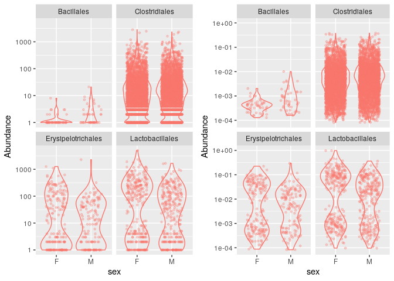<!-- -->

# Sous-ensemble par taxonomie.

Avec la représentation en violon précédente, Lactobacillales semblent
être un ordre taxonomique avec un profil d’abondance bimodal.

On peut donc réitérer cette opération mais seulement avec ce
sous-ensemble taxonomique pour vérifier cette hypothèse et trouver une
explication.

Pour cela, on va créer un nouvel objet psOrd qui va contenir que les
données de l’ordre des lactobacillales de l’objet ps3ra.

On utilise les mêmes arguments que précédemment utilisés pour la
fonction plot\_abundance, à la différence que l’on veut une
représentation de l’objet psOrd.

  - On observe deux genres. Celui de lactobacillus et de Streptococcus.
    Si l’on transpose ces données, cela donne bien un profil d’abondance
    bimodal avec une abondance relative plus élevée pour Lactobacillus
    et moins élevée pour Steptococcus.

<!-- end list -->

``` r
psOrd = subset_taxa(ps3ra, Order == "Lactobacillales")
plot_abundance(psOrd, Facet = "Genus", Color = NULL)
```

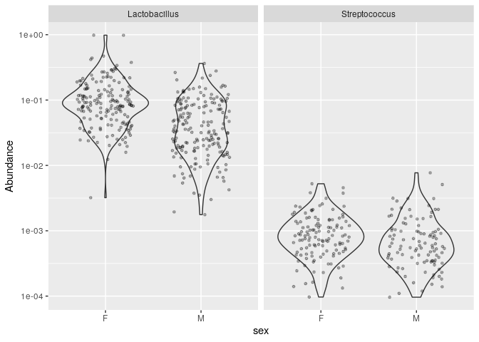<!-- -->

# Prétraitement.

Afin d’utiliser d’autres fonctions d’analyse avec phyloseq, nous allons
représenter avec un histogramme (geom) la répartition de groupe de
souris classer en fonction de leur âge. En ordonné on va retrouver
l’effectif, et en abscisse l’âge. On observe trois groupes.

``` r
qplot(sample_data(ps)$age, geom = "histogram",binwidth=20) + xlab("age")
```

<!-- -->

On peut essayer de représenter la somme des données des otu avec une
échelle logarithmique (log(10)), pour normaliser ces données en vue de
les rendres comparables.

  - On observe “un seul” pic prédominant.

Cette transformation n’est donc pas suffisant.

``` r
qplot(log10(rowSums(otu_table(ps))),binwidth=0.2) +
  xlab("Logged counts-per-sample")
```

<!-- -->
On va à présent réaliser une analyse des coordonnées principales (PCoA).
Cela va nous permettre de représenter graphiquement une matrice de
ressemblance.

Dans le nouvel (objet sample\_data(ps)$age\_binned) à partir de l’objet
ps, on va créer trois catégories d’âge.

  - Une catégorie de \[0-100\]

  - Une catégorie de \[100-200\]

  - Une catégorie de \[200-400\]

dans lequel avec l’argument list on va assigner respectivement
l’étiquette Young100, Mid100to200 et Old200 pour ces trois
catégories.

On va aussi prendre en compte la notion de relation familiale.
C’est-à-dire celles qui sont issues de la même portée.

On va créer l’objet pslog qui va contenir les données d’ordination
transformé par la fonction (transform\_sample\_counts) à partir de
l’objet ps. avec l’argument log(1 + x) on va normaliser ces données.

Dans l’objet out.wuf.log, on crée notre ordination avec PCoA à partir de
la méthode MDS. De plus on va prend une distance unifrac au lieu de
Bray-Curtis.

Eigenvalues est un coefficient par lequel on va multiplier les
coordonées de points de pslog en ordination.

On observe que l’ordination des données d’abondance, montre quelques
valeurs aberrantes.

``` r
sample_data(ps)$age_binned <- cut(sample_data(ps)$age,
                          breaks = c(0, 100, 200, 400))
levels(sample_data(ps)$age_binned) <- list(Young100="(0,100]", Mid100to200="(100,200]", Old200="(200,400]")
sample_data(ps)$family_relationship=gsub(" ","",sample_data(ps)$family_relationship)
pslog <- transform_sample_counts(ps, function(x) log(1 + x))
out.wuf.log <- ordinate(pslog, method = "MDS", distance = "wunifrac")
```

    ## Warning in UniFrac(physeq, weighted = TRUE, ...): Randomly assigning root as --
    ## GCAAGCGTTATCCGGATTTACTGGGTGTAAAGGGAGCGTAGACGGCAATGCAAGCCAGATGTGAAAACCCGCAGCTCAACTGGGGGAGTGCATTTGGAACTGTGTAGCTGGAGTGCAGGAGAGGTAAGCGGAATTCCTGGTGTAGCGGTGAAATGCGTAGATATCAGGAGGAACACCAGTGGCGAAGGCGGCTTACTGGACTGTAACTGACGTTGAGGCTCGAAAGCGTGGGGAG
    ## -- in the phylogenetic tree in the data you provided.

``` r
evals <- out.wuf.log$values$Eigenvalues
plot_ordination(pslog, out.wuf.log, color = "age_binned") +
  labs(col = "Binned Age") +
  coord_fixed(sqrt(evals[2] / evals[1]))
```

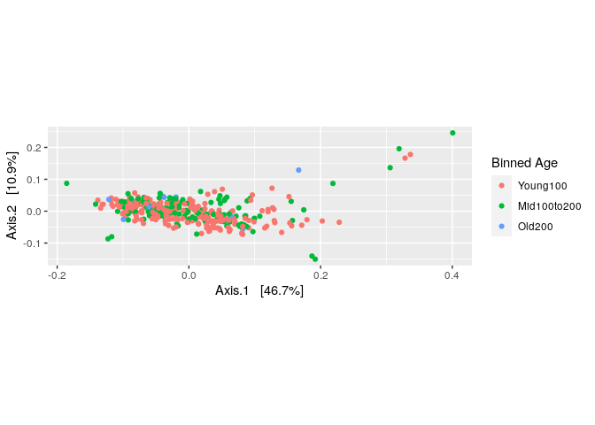<!-- -->

On observe que les échantillons aberrants sont dominés par un seul ASV
(variante de séquence d’amplicon).

``` r
rel_abund <- t(apply(otu_table(ps), 1, function(x) x / sum(x)))
qplot(rel_abund[, 12], geom = "histogram",binwidth=0.05) +
  xlab("Relative abundance")
```

<!-- -->

# Différentes projections d’ordination.

Après avoir mis en évidence les valeurs aberrantes, nous allons calculer
les ordinations avec ces valeurs aberrantes supprimées et observées plus
les différences.

``` r
outliers <- c("F5D165", "F6D165", "M3D175", "M4D175", "M5D175", "M6D175")
ps <- prune_samples(!(sample_names(ps) %in% outliers), ps)
```

Nous allons également supprimer les échantillons avec moins de 1000
lectures

``` r
which(!rowSums(otu_table(ps)) > 1000)
```

    ## F5D145 M1D149   M1D9 M2D125  M2D19 M3D148 M3D149   M3D3   M3D5   M3D8 
    ##     69    185    200    204    218    243    244    252    256    260

On va maintenant, redéfinir l’objet ps en ajoutant que les échantillons
avec plus de 1000 lectures.

Ensuite on va recréer l’objet pslog à partir des nouvelles données de
l’objet ps.

``` r
ps <- prune_samples(rowSums(otu_table(ps)) > 1000, ps)
pslog <- transform_sample_counts(ps, function(x) log(1 + x))
```

Nous allons pouvoir à présent réaliser une seconde PCoA en utilisant une
dissimilarité.

On définit avec les arguments de la fonction plot\_ordination les
paramètres du graphique.

  - On différencie la différence d’âge avec des couleurs
    (color="age\_binned)

  - en fonction de la relation familiale, on va créer des formes
    différentes (shape="")

  - Et on ajoute une légende pour faciliter la compréhension du
    graphique.

On voit qu’il y a un effet d’âge assez important qui est cohérent entre
toutes les souris, mâles et femelles, et de portées différentes.

``` r
out.pcoa.log <- ordinate(pslog,  method = "MDS", distance = "bray")
evals <- out.pcoa.log$values[,1]
plot_ordination(pslog, out.pcoa.log, color = "age_binned",
                  shape = "family_relationship") +
  labs(col = "Binned Age", shape = "Litter")+
  coord_fixed(sqrt(evals[2] / evals[1]))
```

<!-- -->

On va pouvoir maintenant réaliser l’analyse des coordonnées principales
doubles (DPCoA). C’est une méthode d’ordination phylogénétique, qui
permet de donner une représentation biplot des échantillons et des
catégories taxonomiques.

Le deuxième axe correspond aux souris jeunes en comparaison des souris
plus âgées.

Nous avons le premier axe qui explique 75% de la variabilité, environ 9
fois celle du deuxième axe. C’est pour cela que l’on obtient cette forme
allongée.

``` r
out.dpcoa.log <- ordinate(pslog, method = "DPCoA")
evals <- out.dpcoa.log$eig
plot_ordination(pslog, out.dpcoa.log, color = "age_binned", label= "SampleID",
                  shape = "family_relationship") +
  labs(col = "Binned Age", shape = "Litter")+
  coord_fixed(sqrt(evals[2] / evals[1]))
```

<!-- -->

Pour savoir si ce sont bien les taxons qui sont influencés les axes 1 et
2, on va réaliser de nouveau une PCoA à la différence que cette fois-ci,
on va utiliser que les données taxonomiques sans prendre en compte les
différences d’âge.

Cette PCoA nous montre bien que ce sont les taxons qui sont responsables
des axes 1 et 2.

``` r
plot_ordination(pslog, out.dpcoa.log, type = "species", color = "Phylum") +
  coord_fixed(sqrt(evals[2] / evals[1]))
```

<!-- -->

Pour finir nous pouvons regarder les résultats de la PCoA avec une
dissimilarité unifrac pondéré.

Comme pour les analyses précédentes, nous constatons que le deuxième axe
est associé à un effet d’âge, assez similaire au DPCoA.

Cela s’explique par le fait que les deux méthodes d’ordination
phylogénétique prenant en compte l’abondance.

Cependant, lorsque nous comparons les biplots, nous voyons que le DPCoA
a donné une interprétation beaucoup plus claire du deuxième axe, par
rapport à l’Unifrac pondéré.

``` r
out.wuf.log <- ordinate(pslog, method = "PCoA", distance ="wunifrac")
```

    ## Warning in UniFrac(physeq, weighted = TRUE, ...): Randomly assigning root as --
    ## GCAAGCGTTATCCGGATTTACTGGGTGTAAAGGGAGCGTAGACGGCGAAGAAAGTCTGAAGTGAAAGCCCGCGGCTCAACCGCGGAATGGCTTTGGAAACTTTTTTGCTGGAGTACCGGAGAGGTAAGCGGAATTCCTAGTGTAGCGGTGAAATGCGTAGATATTAGGAGGAACACCAGTGGCGAAGGCGGCTTACTGGACGGTAACTGACGTTGAGGCTCGAAAGCGTGGGGAG
    ## -- in the phylogenetic tree in the data you provided.

``` r
evals <- out.wuf.log$values$Eigenvalues
plot_ordination(pslog, out.wuf.log, color = "age_binned",
                  shape = "family_relationship") +
  coord_fixed(sqrt(evals[2] / evals[1])) +
  labs(col = "Binned Age", shape = "Litter")
```

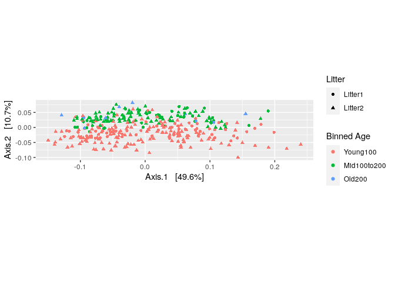<!-- -->

# Pourquoi les tracés d’ordination sont-ils si éloignés ?

Les données sur l’abondance microbienne à partir de données brute
peuvent être difficiles à analyser.

## PCA sur les rangs.

Afin de mieux visualiser les dissimilarités, on va à présent créer des
rangs d’abondance.

``` r
abund <- otu_table(pslog)
abund_ranks <- t(apply(abund, 1, rank))
```

Dans les jeux de données, de nombreuses bactéries sont absentes ou très
peu présentes. Il faut donc supprimer les données de ces bactéries avec
une faible abondance, pour une meilleure analyse.

On va donc supprimer tous les rangs qui sont inférieurs à 329 avec un
score de 0 pour les supprimer de nos jeux de données.

``` r
abund_ranks <- abund_ranks - 329
abund_ranks[abund_ranks < 1] <- 1
```

On va a présent réaliser un graphique de cette abondance. Pour commencer
il faut charger deux library. la library :

  - dplyr qui est est une extension facilitant le traitement et la
    manipulation de données contenues dans une ou plusieurs tables.

  - reshape2 qui permet de restructurer et agréger les données de
    manière flexible.

On va maintenant préparer un nouvel objet abund\_df qui va contenir les
données d’abondance. pour cela on va :

  - Créer une colonne à la table avec les rangs des abondances.

  - Prendre 8 échantillons aléatoirement

Avec la représentation graphique, on observe que les données sont
parfaitement exploitables, pour réaliser une PCA (analyse de composante
principale), qui est une méthode de réduction des dimensions?

``` r
library(dplyr)
```

    ## 
    ## Attaching package: 'dplyr'

    ## The following object is masked from 'package:gridExtra':
    ## 
    ##     combine

    ## The following objects are masked from 'package:Biostrings':
    ## 
    ##     collapse, intersect, setdiff, setequal, union

    ## The following object is masked from 'package:XVector':
    ## 
    ##     slice

    ## The following objects are masked from 'package:IRanges':
    ## 
    ##     collapse, desc, intersect, setdiff, slice, union

    ## The following objects are masked from 'package:S4Vectors':
    ## 
    ##     first, intersect, rename, setdiff, setequal, union

    ## The following objects are masked from 'package:BiocGenerics':
    ## 
    ##     combine, intersect, setdiff, union

    ## The following objects are masked from 'package:stats':
    ## 
    ##     filter, lag

    ## The following objects are masked from 'package:base':
    ## 
    ##     intersect, setdiff, setequal, union

``` r
library(reshape2)
abund_df <- melt(abund, value.name = "abund") %>%
  left_join(melt(abund_ranks, value.name = "rank"))
```

    ## Joining, by = c("Var1", "Var2")

``` r
colnames(abund_df) <- c("sample", "seq", "abund", "rank")

abund_df <- melt(abund, value.name = "abund") %>%
  left_join(melt(abund_ranks, value.name = "rank"))
```

    ## Joining, by = c("Var1", "Var2")

``` r
colnames(abund_df) <- c("sample", "seq", "abund", "rank")

sample_ix <- sample(1:nrow(abund_df), 8)
ggplot(abund_df %>%
         filter(sample %in% abund_df$sample[sample_ix])) +
  geom_point(aes(x = abund, y = rank, col = sample),
             position = position_jitter(width = 0.2), size = 1.5) +
  labs(x = "Abundance", y = "Thresholded rank") +
  scale_color_brewer(palette = "Set2")
```

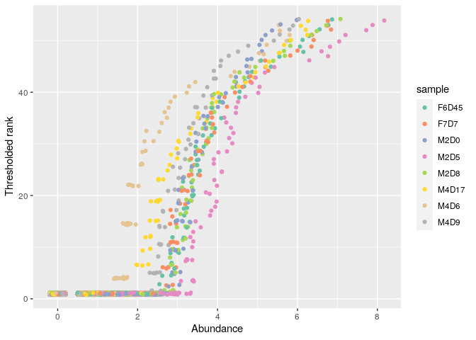<!-- -->

On va a présent représenter trois PCA en fonction des âges. Ces PCA
permettent une meilleure analyse graphique.

De plus les résultats sont similaires à nos PCoA obtenues sans la
transformation des rangs, on peut donc dire que nos analyses sont
relativement sûres.

``` r
library(ade4)
```

    ## 
    ## Attaching package: 'ade4'

    ## The following object is masked from 'package:Biostrings':
    ## 
    ##     score

    ## The following object is masked from 'package:BiocGenerics':
    ## 
    ##     score

``` r
ranks_pca <- dudi.pca(abund_ranks, scannf = F, nf = 3)
row_scores <- data.frame(li = ranks_pca$li,
                         SampleID = rownames(abund_ranks))
col_scores <- data.frame(co = ranks_pca$co,
                         seq = colnames(abund_ranks))
tax <- tax_table(ps) %>%
  data.frame(stringsAsFactors = FALSE)
tax$seq <- rownames(tax)
main_orders <- c("Clostridiales", "Bacteroidales", "Lactobacillales",
                 "Coriobacteriales")
tax$Order[!(tax$Order %in% main_orders)] <- "Other"
tax$Order <- factor(tax$Order, levels = c(main_orders, "Other"))
tax$otu_id <- seq_len(ncol(otu_table(ps)))
row_scores <- row_scores %>%
  left_join(sample_data(pslog))
```

    ## Joining, by = "SampleID"

    ## Warning in class(x) <- c(setdiff(subclass, tibble_class), tibble_class): Setting
    ## class(x) to multiple strings ("tbl_df", "tbl", ...); result will no longer be an
    ## S4 object

``` r
col_scores <- col_scores %>%
  left_join(tax)
```

    ## Joining, by = "seq"

``` r
evals_prop <- 100 * (ranks_pca$eig / sum(ranks_pca$eig))
ggplot() +
  geom_point(data = row_scores, aes(x = li.Axis1, y = li.Axis2), shape = 2) +
  geom_point(data = col_scores, aes(x = 25 * co.Comp1, y = 25 * co.Comp2, col = Order),
             size = .3, alpha = 0.6) +
  scale_color_brewer(palette = "Set2") +
  facet_grid(~ age_binned) +
  guides(col = guide_legend(override.aes = list(size = 3))) +
  labs(x = sprintf("Axis1 [%s%% variance]", round(evals_prop[1], 2)),
       y = sprintf("Axis2 [%s%% variance]", round(evals_prop[2], 2))) +
  coord_fixed(sqrt(ranks_pca$eig[2] / ranks_pca$eig[1])) +
  theme(panel.border = element_rect(color = "#787878", fill = alpha("white", 0)))
```

<!-- -->

\#Correspondance canonique

L’analyse de correspondance canonique (CCpnA) est une approche de
l’ordination d’une espèce par table d’échantillons qui intègre des
informations supplémentaires sur les échantillons.

On va réutiliser l’objet pslog pour l’ordination, qui contenait les
données d’âge et les liens familiaux.

``` r
ps_ccpna <- ordinate(pslog, "CCA", formula = pslog ~ age_binned + family_relationship)
```

On doit pour commencer charger le package ggrepel qui fournit des
éléments géographiques de texte et d’étiquette pour «ggplot2» qui
aident à éviter le chevauchement des étiquettes de texte.

On ajoute les données environnementales, et créer des scores pour
faciliter l’annotation des figures.

Ces scores vont être ajoutés à un nouvel objet sites
(data.frame(ps\_scores$sites))

Sur les 23 ordres taxonomiques totaux, nous n’annotons explicitement que
les quatre plus abondants. Cela rend le graphique plus facile à lire.

``` r
library(ggrepel)
ps_scores <- vegan::scores(ps_ccpna)
sites <- data.frame(ps_scores$sites)
sites$SampleID <- rownames(sites)
sites <- sites %>%
  left_join(sample_data(ps))
```

    ## Joining, by = "SampleID"

    ## Warning in class(x) <- c(setdiff(subclass, tibble_class), tibble_class): Setting
    ## class(x) to multiple strings ("tbl_df", "tbl", ...); result will no longer be an
    ## S4 object

``` r
species <- data.frame(ps_scores$species)
species$otu_id <- seq_along(colnames(otu_table(ps)))
species <- species %>%
  left_join(tax)
```

    ## Joining, by = "otu_id"

``` r
evals_prop <- 100 * ps_ccpna$CCA$eig[1:2] / sum(ps_ccpna$CA$eig)
ggplot() +
  geom_point(data = sites, aes(x = CCA1, y = CCA2), shape = 2, alpha = 0.5) +
  geom_point(data = species, aes(x = CCA1, y = CCA2, col = Order), size = 0.5) +
  geom_text_repel(data = species %>% filter(CCA2 < -2),
                    aes(x = CCA1, y = CCA2, label = otu_id),
            size = 1.5, segment.size = 0.1) +
  facet_grid(. ~ family_relationship) +
  guides(col = guide_legend(override.aes = list(size = 3))) +
  labs(x = sprintf("Axis1 [%s%% variance]", round(evals_prop[1], 2)),
        y = sprintf("Axis2 [%s%% variance]", round(evals_prop[2], 2))) +
  scale_color_brewer(palette = "Set2") +
  coord_fixed(sqrt(ps_ccpna$CCA$eig[2] / ps_ccpna$CCA$eig[1])*0.45   ) +
  theme(panel.border = element_rect(color = "#787878", fill = alpha("white", 0)))
```

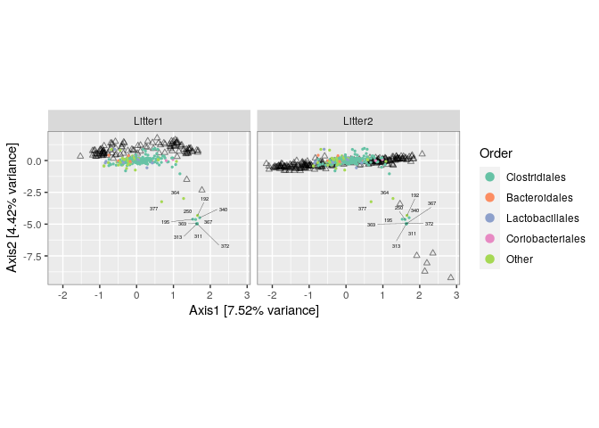<!-- -->

# Enseignement supervisé.

Avec l’étape précédente, nous avons pu remarquer une différence de la
diversité du microbiome en fonction de l’âge. On va donc maintenant
appliquer des techniques de supervisation pour essayer de prédire l’âge
d’une souris à partir de la diversité du microbiome.

  - le package tandomForest implémente l’algorithme de foret aléatoire
    de Breiman (basé sur le code Fortran original de Breiman et Cutler)
    pour la classification et la régression.

  - Le package e1071 contient plusieurs fonctions pour l’analyse de
    classe.

  - Le package caret contient plusieurs fonctions pour la formation et
    le traçage des modèles de classification et de régression.

<!-- end list -->

``` r
library(randomForest)
```

    ## randomForest 4.6-14

    ## Type rfNews() to see new features/changes/bug fixes.

    ## 
    ## Attaching package: 'randomForest'

    ## The following object is masked from 'package:dplyr':
    ## 
    ##     combine

    ## The following object is masked from 'package:gridExtra':
    ## 
    ##     combine

    ## The following object is masked from 'package:ggplot2':
    ## 
    ##     margin

    ## The following object is masked from 'package:BiocGenerics':
    ## 
    ##     combine

``` r
library(e1071)
library(caret)
```

    ## Loading required package: lattice

On réutilise l’objet pslog , avec les classes d’âge (0, 100, 400)

Pour cette analyse on va utiliser huit échantillons de souris prit
aléatoirement que l’on va transférer dans un nouvel objet traininMice.

Cependant pour avoir l’identité des souris que l’on utilise, on va créer
un autre objet inTrain. Cela va nous permettre aussi de vérifier si on
peut bien déterminer l’âge avec l’enseignement supervisé.

``` r
library(caret)
sample_data(pslog)$age2 <- cut(sample_data(pslog)$age, c(0, 100, 400))
dataMatrix <- data.frame(age = sample_data(pslog)$age2, otu_table(pslog))
# take 8 mice at random to be the training set, and the remaining 4 the test set
trainingMice <- sample(unique(sample_data(pslog)$host_subject_id), size = 8)
inTrain <- which(sample_data(pslog)$host_subject_id %in% trainingMice)
training <- dataMatrix[inTrain,]
testing <- dataMatrix[-inTrain,]
plsFit <- train(age ~ ., data = training,
                method = "pls", preProc = "center")
```

Ensuite, nous pouvons prédire les étiquettes de classe sur l’ensemble de
tests en utilisant la fonction predict et les comparer avec les données
exactes. On observe des résultats assez fidèles à la réalité.

``` r
plsClasses <- predict(plsFit, newdata = testing)
table(plsClasses, testing$age)
```

    ##            
    ## plsClasses  (0,100] (100,400]
    ##   (0,100]        65         1
    ##   (100,400]       2        44

On peut aussi essayer de créer des forêts aléatoires. Cela va être
possible grâce au package TandomForest. Avec RandomForest on va pouvoir
générer une diversité aléatoire d’un microbiome. On va ensuite les
appliquer sur nos résultats de notre enseignement supervisé.

On observe des résultats corrects, cependant il y a quand même plus de
veilles souris classées à tort comme jeunes.

``` r
library(randomForest)
rfFit <- train(age ~ ., data = training, method = "rf",
               preProc = "center", proximity = TRUE)
rfClasses <- predict(rfFit, newdata = testing)
table(rfClasses, testing$age)
```

    ##            
    ## rfClasses   (0,100] (100,400]
    ##   (0,100]        66         7
    ##   (100,400]       1        38

Maintenant pour observer graphiquement ces résultats, il faut à présent
créer des biplots.

``` r
library(vegan)
```

    ## Loading required package: permute

    ## This is vegan 2.5-7

    ## 
    ## Attaching package: 'vegan'

    ## The following object is masked from 'package:caret':
    ## 
    ##     tolerance

``` r
library(phyloseq)
library(dplyr)
pls_biplot <- list("loadings" = loadings(plsFit$finalModel),
                   "scores" = scores(plsFit$finalModel))
class(pls_biplot$scores) <- "matrix"

pls_biplot$scores <- data.frame(sample_data(pslog)[inTrain, ],
                                pls_biplot$scores)

tax <- tax_table(ps)@.Data %>%
  data.frame(stringsAsFactors = FALSE)
main_orders <- c("Clostridiales", "Bacteroidales", "Lactobacillales",
                 "Coriobacteriales")
tax$Order[!(tax$Order %in% main_orders)] <- "Other"
tax$Order <- factor(tax$Order, levels = c(main_orders, "Other"))
class(pls_biplot$loadings) <- "matrix"
pls_biplot$loadings <- data.frame(tax, pls_biplot$loadings)
ggplot() +
  geom_point(data = pls_biplot$scores,
             aes(x = Comp.1, y = Comp.2), shape = 2) +
  geom_point(data = pls_biplot$loadings,
             aes(x = 25 * Comp.1, y = 25 * Comp.2, col = Order),
             size = 0.3, alpha = 0.6) +
  scale_color_brewer(palette = "Set2") +
  labs(x = "Axis1", y = "Axis2", col = "Binned Age") +
  guides(col = guide_legend(override.aes = list(size = 3))) +
  facet_grid( ~ age2) +
  theme(panel.border = element_rect(color = "#787878", fill = alpha("white", 0)))
```

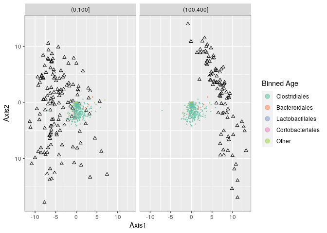<!-- -->

Maintenant pour les données générées par randomForest il faut réaliser
des graphiques de proximité. Pour générer cette représentation, une
distance est calculée entre les échantillons en fonction de la fréquence
à laquelle l’échantillon se produit dans la même partition d’arbre de la
forêt aléatoire. On observe bien deux groupes d’âge.

``` r
rf_prox <- cmdscale(1 - rfFit$finalModel$proximity) %>%
  data.frame(sample_data(pslog)[inTrain, ])

ggplot(rf_prox) +
  geom_point(aes(x = X1, y = X2, col = age_binned),
             size = 1, alpha = 0.7) +
  scale_color_manual(values = c("#A66EB8", "#238DB5", "#748B4F")) +
  guides(col = guide_legend(override.aes = list(size = 4))) +
  labs(col = "Binned Age", x = "Axis1", y = "Axis2")
```

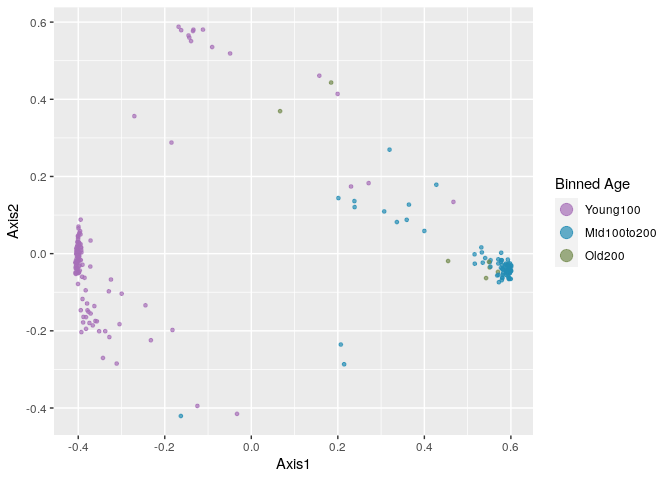<!-- -->

Nous pouvons à présent déterminer quels sont les familles et genre
bactériens qui nous ont permis de déterminer l’âge. On peut remarquer
qu’il s’agit de de la famille des Lachnospiracées et du genre Roseburia

``` r
as.vector(tax_table(ps)[which.max(importance(rfFit$finalModel)), c("Family", "Genus")])
```

    ## [1] "Lachnospiraceae" "Roseburia"

Maintenant nous avons identifié les bactéries ayant le plus d’influence
dans la prédiction aléatoire de la forêt. Il s’agit des bactéries de la
famille des Lachnospiracées et du genre Roseburia.

On peut donc représenter son abondance dans les échantillons.

On voit qu’il est uniformément très bas de 0 à 100 jours et beaucoup
plus élevé de 100 à 400 jours.

``` r
impOtu <- as.vector(otu_table(pslog)[,which.max(importance(rfFit$finalModel))])
maxImpDF <- data.frame(sample_data(pslog), abund = impOtu)
ggplot(maxImpDF) +   geom_histogram(aes(x = abund)) +
  facet_grid(age2 ~ .) +
  labs(x = "Abundance of discriminative bacteria", y = "Number of samples")
```

    ## `stat_bin()` using `bins = 30`. Pick better value with `binwidth`.

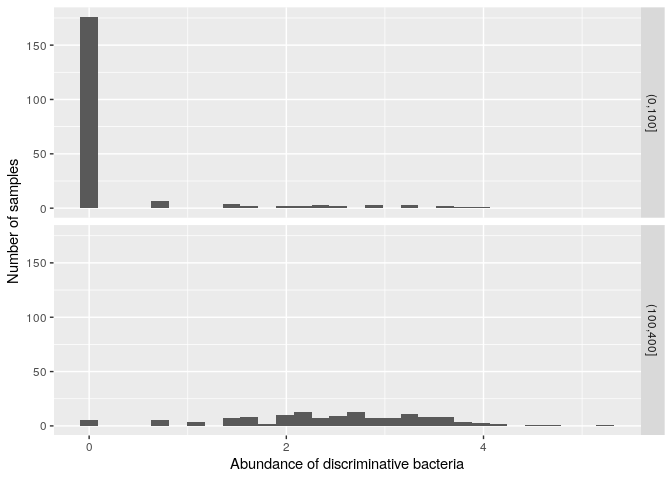<!-- -->

# Analyses basées sur des graphiques.

## Créer et tracer des graphiques.

Pour ces analyses, on va besoin de charger de nouveaux packages.

  - Le package phyloseqGraphTest permet de tester les différences entre
    les groupes d’échantillons avec un test de permutation basé sur un
    graphique.

  - Le package igraph permet de gérer les grands graphiques et fournit
    des fonctions pour générer des graphiques aléatoires et réguliers,
    la visualisation de graphiques et d’autres nombreuses fonctions.

  - Le package ggnetwork permet de générer des géométries pour tracer
    des objets réseau avec ‘ggplot2’.

<!-- end list -->

``` r
library("phyloseqGraphTest")
library("igraph")
```

    ## 
    ## Attaching package: 'igraph'

    ## The following object is masked from 'package:vegan':
    ## 
    ##     diversity

    ## The following object is masked from 'package:permute':
    ## 
    ##     permute

    ## The following objects are masked from 'package:dplyr':
    ## 
    ##     as_data_frame, groups, union

    ## The following objects are masked from 'package:ape':
    ## 
    ##     edges, mst, ring

    ## The following object is masked from 'package:Biostrings':
    ## 
    ##     union

    ## The following object is masked from 'package:IRanges':
    ## 
    ##     union

    ## The following object is masked from 'package:S4Vectors':
    ## 
    ##     union

    ## The following objects are masked from 'package:BiocGenerics':
    ## 
    ##     normalize, path, union

    ## The following objects are masked from 'package:stats':
    ## 
    ##     decompose, spectrum

    ## The following object is masked from 'package:base':
    ## 
    ##     union

``` r
library("ggnetwork")
```

Nous allons à présent créer à partir des données de l’objet ps, un objet
net\_graph, pour ensuite le représenter graphiquement avec la fonction
ggplot.

Cependant on va utiliser pour générer les données de net, on va utiliser
la fonction make\_network sur la base d’une matrice de la dissimilarité
de Jaccard (0.35).

La fonction V(net), quant à elle permet de calculer la variance pour La
régression Linéaire. Cela va nous permettre une meilleure interprétation
graphique. en faisant un lien entre les données en réseau.

On définit par la suite les paramètres de représentation graphique
(couleur et différentes formes par portée la taille etc …)

Les couleurs de la figure représentent la souris d’où provient
l’échantillon et la forme représente la portée dans laquelle se
trouvait la souris. Nous pouvons voir qu’il existe un regroupement des
échantillons par souris et par portée.

``` r
net <- make_network(ps, max.dist=0.35)
sampledata <- data.frame(sample_data(ps))
V(net)$id <- sampledata[names(V(net)), "host_subject_id"]
V(net)$litter <- sampledata[names(V(net)), "family_relationship"]

net_graph <- ggnetwork(net)


ggplot(net_graph, aes(x = x, y = y, xend = xend, yend = yend), layout = "fruchtermanreingold") +
  geom_edges(color = "darkgray") +
  geom_nodes(aes(color = id, shape = litter),  size = 3 ) +
  theme(axis.text = element_blank(), axis.title = element_blank(),
        legend.key.height = unit(0.5,"line")) +
  guides(col = guide_legend(override.aes = list(size = .5)))
```

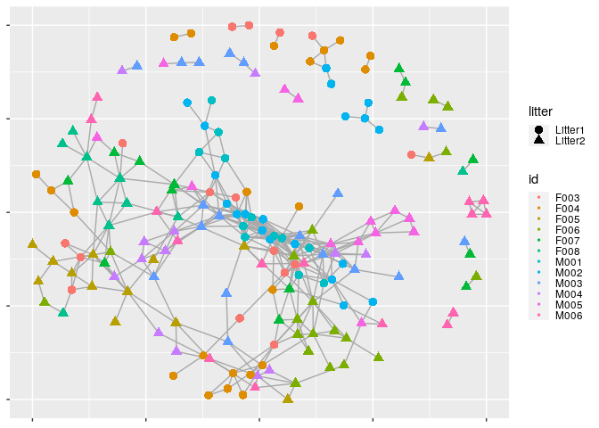<!-- -->

## Tests à deux échantillons basés sur des graphiques.

## Arbre couvrant minimum (MST)

Nous allons maintenant réaliser un arbre couvrant minimum (MST) avec une
dissemblance Jaccard.

Cela va nous permettre de savoir si les deux portées proviennent de la
même distribution.

Puisqu’il y a un regroupement dans les données par individu (
host\_subject\_id), nous ne pouvons pas simplement permuter toutes les
étiquettes, nous devons maintenir cette structure imbriquée.

c’est ce que fait l’argument groping. Ici, nous permutons les étiquettes
mais gardons la structure intacte.

On observe petit p-value (0.002). On va donc rejeter l’hypothèse que les
deux échantillons proviennent de la même distribution.

``` r
gt <- graph_perm_test(ps, "family_relationship", grouping = "host_subject_id",
                      distance = "jaccard", type = "mst")
gt$pval
```

    ## [1] 0.008

Quand on représente graphiquement l’arbre, on observe que les
échantillons sont regroupés beaucoup plus par portée. En effet, il y a
très peu de mélanges entre individus de portée différentes.

``` r
plotNet1=plot_test_network(gt) + theme(legend.text = element_text(size = 8),
        legend.title = element_text(size = 9))
plotPerm1=plot_permutations(gt)
grid.arrange(ncol = 2,  plotNet1, plotPerm1)
```

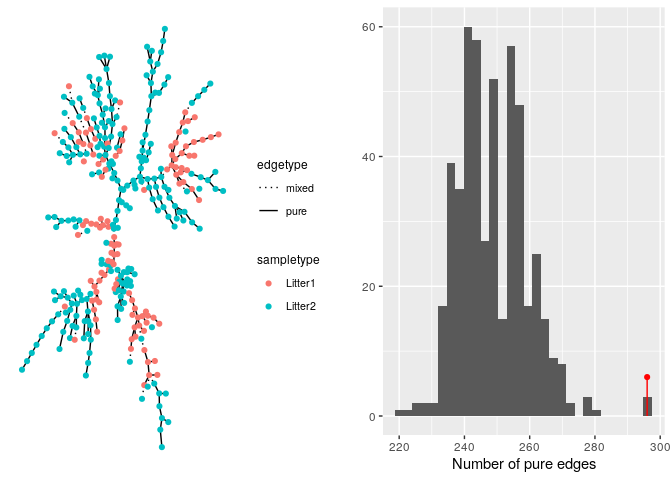<!-- -->

### Voisins les plus proches.

En changeant de représentation graphique, on observe sensiblement les
mêmes résultats.

``` r
gt <- graph_perm_test(ps, "family_relationship", grouping = "host_subject_id",
                      distance = "jaccard", type = "knn", knn = 1)
plotNet2=plot_test_network(gt) + theme(legend.text = element_text(size = 8),
        legend.title = element_text(size = 9))
plotPerm2=plot_permutations(gt)
grid.arrange(ncol = 2,  plotNet2, plotPerm2)
```

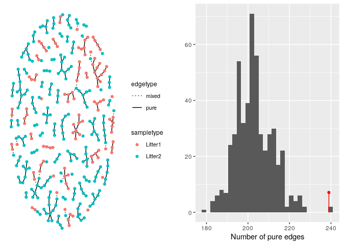<!-- -->

# Modélisation linéaire.

Il est souvent intéressant d’évaluer dans quelle mesure la diversité des
communautés microbiennes reflète les caractéristiques de l’environnement
à partir duquel elles ont été prélevées. Contrairement à l’ordination,
le but de cette analyse n’est pas de développer une représentation de
nombreuses bactéries par rapport aux caractéristiques de l’échantillon.

Il s’agit plutôt de décrire comment une mesure unique de la structure
globale de la communauté est associée aux caractéristiques de
l’échantillon.

On va étudier ici un modèle mixte pour voir la relation entre en
biodiversité bactérien et les classes d’âge ou encore de la portée.

On va donc ajouter pour nos objets calculés alpha-diversité avec
l’indice de Shannon qui met en évidence aussi bien le nombre d’espèces
que leur abondance et de les classer en fonction de cette valeur.

``` r
library("nlme")
```

    ## 
    ## Attaching package: 'nlme'

    ## The following object is masked from 'package:dplyr':
    ## 
    ##     collapse

    ## The following object is masked from 'package:Biostrings':
    ## 
    ##     collapse

    ## The following object is masked from 'package:IRanges':
    ## 
    ##     collapse

``` r
library("reshape2")
ps_alpha_div <- estimate_richness(ps, split = TRUE, measure = "Shannon")
ps_alpha_div$SampleID <- rownames(ps_alpha_div) %>%
  as.factor()
ps_samp <- sample_data(ps) %>%
  unclass() %>%
  data.frame() %>%
  left_join(ps_alpha_div, by = "SampleID") %>%
  melt(measure.vars = "Shannon",
       variable.name = "diversity_measure",
       value.name = "alpha_diversity")

# reorder's facet from lowest to highest diversity
diversity_means <- ps_samp %>%
  group_by(host_subject_id) %>%
  summarise(mean_div = mean(alpha_diversity)) %>%
  arrange(mean_div)
```

    ## `summarise()` ungrouping output (override with `.groups` argument)

``` r
ps_samp$host_subject_id <- factor(ps_samp$host_subject_id)
#                                  diversity_means$host_subject_id)
alpha_div_model <- lme(fixed = alpha_diversity ~ age_binned, data = ps_samp,
                       random = ~ 1 | host_subject_id)
new_data <- expand.grid(host_subject_id = levels(ps_samp$host_subject_id),
                        age_binned = levels(ps_samp$age_binned))
new_data$pred <- predict(alpha_div_model, newdata = new_data)
X <- model.matrix(eval(eval(alpha_div_model$call$fixed)[-2]),
                  new_data[-ncol(new_data)])
pred_var_fixed <- diag(X %*% alpha_div_model$varFix %*% t(X))
new_data$pred_var <- pred_var_fixed + alpha_div_model$sigma ^ 2
# fitted values, with error bars
ggplot(ps_samp %>% left_join(new_data)) +
  geom_errorbar(aes(x = age_binned, ymin = pred - 2 * sqrt(pred_var),
                    ymax = pred + 2 * sqrt(pred_var)),
                col = "#858585", size = .1) +
  geom_point(aes(x = age_binned, y = alpha_diversity,
                 col = family_relationship), size = 0.8) +
  facet_wrap(~host_subject_id) +
  scale_y_continuous(limits = c(2.4, 4.6), breaks = seq(0, 5, .5)) +
  scale_color_brewer(palette = "Set2") +
  labs(x = "Binned Age", y = "Shannon Diversity", color = "Litter") +
  guides(col = guide_legend(override.aes = list(size = 4))) +
  theme(panel.border = element_rect(color = "#787878", fill = alpha("white", 0)),
        axis.text.x = element_text(angle = -90, size = 6),
        axis.text.y = element_text(size = 6))
```

    ## Joining, by = c("host_subject_id", "age_binned")

<!-- -->

# Tests multiples hiérarchiques.

En appliquant la méthode des tests multiples hiérarchiques on va pouvoir
tester l’association entre l’abondance microbienne et l’âge. Cela
fournit une vue complémentaire des analyses précédentes, identifiant les
bactéries individuelles responsables des différences entre les souris
jeunes et âgées.

``` r
library("reshape2")
library("DESeq2")
#New version of DESeq2 needs special levels
sample_data(ps)$age_binned <- cut(sample_data(ps)$age,
                          breaks = c(0, 100, 200, 400))
levels(sample_data(ps)$age_binned) <- list(Young100="(0,100]", Mid100to200="(100,200]", Old200="(200,400]")
sample_data(ps)$family_relationship = gsub(" ", "", sample_data(ps)$family_relationship)
ps_dds <- phyloseq_to_deseq2(ps, design = ~ age_binned + family_relationship)
```

    ## Warning in DESeqDataSet(se, design = design, ignoreRank): some variables in
    ## design formula are characters, converting to factors

``` r
# geometric mean, set to zero when all coordinates are zero
geo_mean_protected <- function(x) {
  if (all(x == 0)) {
    return (0)
  }
  exp(mean(log(x[x != 0])))
}

geoMeans <- apply(counts(ps_dds), 1, geo_mean_protected)
ps_dds <- estimateSizeFactors(ps_dds, geoMeans = geoMeans)
ps_dds <- estimateDispersions(ps_dds)
abund <- getVarianceStabilizedData(ps_dds)
```

On va utiliser le package structSSI pour effectuer les tests
hiérarchiques. Cependant, on va d’abord raccourcir le nom de chaque
taxon pour faciliter l’analyse.

``` r
short_names <- substr(rownames(abund), 1, 5)%>%
  make.names(unique = TRUE)
rownames(abund) <- short_names
```

L’histogramme en haut donne l’abondance totale transformée en DESeq2
dans chaque échantillon.

``` r
abund_sums <- rbind(data.frame(sum = colSums(abund),
                               sample = colnames(abund),
                               type = "DESeq2"),
                    data.frame(sum = rowSums(otu_table(pslog)),
                               sample = rownames(otu_table(pslog)),
                               type = "log(1 + x)"))

ggplot(abund_sums) +
  geom_histogram(aes(x = sum), binwidth = 20) +
  facet_grid(type ~ .) +
  xlab("Total abundance within sample")
```

<!-- -->

Nous allons étudier de façon hiérarchique les données pouvant influencer
les différents résultats obtenus de nos échantillons.

``` r
library("structSSI")
el <- phy_tree(pslog)$edge
el0 <- el
el0 <- el0[nrow(el):1, ]
el_names <- c(short_names, seq_len(phy_tree(pslog)$Nnode))
el[, 1] <- el_names[el0[, 1]]
el[, 2] <- el_names[as.numeric(el0[, 2])]
unadj_p <- treePValues(el, abund, sample_data(pslog)$age_binned)
```

Nous pouvons maintenant corriger p-valeur en utilisant la procédure de
test hiérarchique.

``` r
hfdr_res <- hFDR.adjust(unadj_p, el, .75)
summary(hfdr_res)
```

    ## Number of hypotheses: 764 
    ## Number of tree discoveries: 579 
    ## Estimated tree FDR: 1 
    ## Number of tip discoveries: 280 
    ## Estimated tips FDR: 1 
    ## 
    ##  hFDR adjusted p-values: 
    ##                 unadjp         adjp adj.significance
    ## GCAAG.95  1.861873e-82 3.723745e-82              ***
    ## GCAAG.70  1.131975e-75 2.263950e-75              ***
    ## GCAAG.187 5.148758e-59 1.029752e-58              ***
    ## GCAAG.251 3.519276e-50 7.038553e-50              ***
    ## GCAAG.148 1.274481e-49 2.548962e-49              ***
    ## GCAAG.30  9.925218e-49 1.985044e-48              ***
    ## GCGAG.76  1.722591e-46 3.445183e-46              ***
    ## GCAAG.167 6.249050e-43 1.249810e-42              ***
    ## 255       8.785479e-40 1.757096e-39              ***
    ## GCAAG.64  2.727610e-36 5.455219e-36              ***
    ## [only 10 most significant hypotheses shown] 
    ## --- 
    ## Signif. codes:  0 '***' 0.015 '**' 0.15 '*' 0.75 '.' 1.5 '-' 1

``` r
#interactive part: not run
plot(hfdr_res, height = 5000) # opens in a browser
```

``` r
tax <- tax_table(pslog)[, c("Family", "Genus")] %>%
  data.frame()
tax$seq <- short_names
```

Il semble que les bactéries les plus fortement associées appartiennent
toutes à la famille des Lachnospiracées , ce qui est cohérent avec les
résultats aléatoires de la forêt.

``` r
options(digits=3)
hfdr_res@p.vals$seq <- rownames(hfdr_res@p.vals)
tax %>%
  left_join(hfdr_res@p.vals) %>%
  arrange(adjp) %>% head(10)
```

    ## Joining, by = "seq"

    ##             Family            Genus       seq   unadjp     adjp
    ## 1  Lachnospiraceae             <NA>  GCAAG.95 1.86e-82 3.72e-82
    ## 2  Lachnospiraceae        Roseburia  GCAAG.70 1.13e-75 2.26e-75
    ## 3  Lachnospiraceae Clostridium_XlVa GCAAG.187 5.15e-59 1.03e-58
    ## 4  Lachnospiraceae             <NA> GCAAG.251 3.52e-50 7.04e-50
    ## 5  Lachnospiraceae Clostridium_XlVa GCAAG.148 1.27e-49 2.55e-49
    ## 6  Lachnospiraceae             <NA>  GCAAG.30 9.93e-49 1.99e-48
    ## 7  Ruminococcaceae     Ruminococcus  GCGAG.76 1.72e-46 3.45e-46
    ## 8  Lachnospiraceae Clostridium_XlVa GCAAG.167 6.25e-43 1.25e-42
    ## 9  Lachnospiraceae        Roseburia  GCAAG.64 2.73e-36 5.46e-36
    ## 10            <NA>             <NA>   GCAAG.1 5.22e-35 1.04e-34
    ##    adj.significance
    ## 1               ***
    ## 2               ***
    ## 3               ***
    ## 4               ***
    ## 5               ***
    ## 6               ***
    ## 7               ***
    ## 8               ***
    ## 9               ***
    ## 10              ***

# Techniques polyvalentes.

Étant donné que les données sur la souris utilisées ci-dessus ne
comprenaient qu’un seul tableau, nous utilisons un nouvel ensemble de
données, collecté par l’étude (Kashyap et al. 2013).

Il y a deux tableaux ici, un pour les bactéries et un autre avec des
métabolites. 12 échantillons ont été obtenus.

On va essayer maintenant à partir de ces nouvelles données de mettre en
relation avec les données des microbiomes des souris utilisés dans les
analyses précédentes.

``` r
metab <- read.csv("https://raw.githubusercontent.com/spholmes/F1000_workflow/master/data/metabolites.csv",row.names = 1)
microbe_connect <-url("https://raw.githubusercontent.com/spholmes/F1000_workflow/master/data/microbe.rda")
load(microbe_connect)
microbe
```

    ## phyloseq-class experiment-level object
    ## otu_table()   OTU Table:         [ 20609 taxa and 12 samples ]
    ## tax_table()   Taxonomy Table:    [ 20609 taxa by 6 taxonomic ranks ]
    ## phy_tree()    Phylogenetic Tree: [ 20609 tips and 20607 internal nodes ]

Cependant dans les données, on avait environ 96% des entrées du tableau
d’abondance microbienne qui sont nulles.

On va donc filtrer les données associées aux microbes et des métabolites
d’intérêt en supprimant ceux qui sont nul.

``` r
library("genefilter")
```

    ## 
    ## Attaching package: 'genefilter'

    ## The following objects are masked from 'package:matrixStats':
    ## 
    ##     rowSds, rowVars

``` r
keep_ix <- rowSums(metab == 0) <= 3
metab <- metab[keep_ix, ]
microbe <- prune_taxa(taxa_sums(microbe) > 4, microbe)
microbe <- filter_taxa(microbe, filterfun(kOverA(3, 2)), TRUE)
metab <- log(1 + metab, base = 10)
X <- otu_table(microbe)
X[X > 50] <- 50
dim(X)
```

    ## [1] 174  12

Nous voyons que X et metab ont 12 colonnes, ce sont en fait les
échantillons et nous les transposerons.

``` r
dim(metab)
```

    ## [1] 405  12

Nous pouvons maintenant appliquer une CCA. Cette méthode compare des
ensembles d’entités dans des tables de données de grandes dimensions, où
il peut y avoir plus d’entités mesurées que d’échantillons.

Cela va nous permettre de comparer nos différentes données dans nos
différents tableaux afin de trouver des covariances dans les ensembles.

Avec ces paramètres, 5 bactéries et 15 métabolites ont été sélectionnés,
en fonction de leur capacité à expliquer la covariation entre les
tableaux.

``` r
library(PMA)
cca_res <- CCA(t(X),  t(metab), penaltyx = .15, penaltyz = .15)
```

    ## 123456789101112131415

``` r
cca_res
```

    ## Call: CCA(x = t(X), z = t(metab), penaltyx = 0.15, penaltyz = 0.15)
    ## 
    ## 
    ## Num non-zeros u's:  5 
    ## Num non-zeros v's:  15 
    ## Type of x:  standard 
    ## Type of z:  standard 
    ## Penalty for x: L1 bound is  0.15 
    ## Penalty for z: L1 bound is  0.15 
    ## Cor(Xu,Zv):  0.974

Avec ces éléments sélectionnés (5 bactéries et 15 métabolites) nous
allons maintenant tenter de combiner nos informations pour relier nos
métabolites et nos OTU.

``` r
combined <- cbind(t(X[cca_res$u != 0, ]),
                  t(metab[cca_res$v != 0, ]))
pca_res <- dudi.pca(combined, scannf = F, nf = 3)
```

On peut à présent réaliser un triplot de PCA montrant les différents
types d’échantillons et les caractéristiques des métabolites et des OTU.
Cela permet une comparaison entre les échantillons mesurés.

``` r
genotype <- substr(rownames(pca_res$li), 1, 2)
sample_type <- substr(rownames(pca_res$l1), 3, 4)
feature_type <- grepl("\\.", colnames(combined))
feature_type <- ifelse(feature_type, "Metabolite", "OTU")
sample_info <- data.frame(pca_res$li, genotype, sample_type)
feature_info <- data.frame(pca_res$c1,
                           feature = substr(colnames(combined), 1, 6))
```

``` r
ggplot() +  geom_point(data = sample_info,
            aes(x = Axis1, y = Axis2, col = sample_type, shape = genotype), size = 3) + 
  geom_label_repel(data = feature_info,
                   aes(x = 5.5 * CS1, y = 5.5 * CS2, label = feature, fill = feature_type),
                   size = 2, segment.size = 0.3,
                   label.padding = unit(0.1, "lines"), label.size = 0) +
  geom_point(data = feature_info,
             aes(x = 5.5 * CS1, y = 5.5 * CS2, fill = feature_type),
             size = 1, shape = 23, col = "#383838") +
  scale_color_brewer(palette = "Set2") +
  scale_fill_manual(values = c("#a6d854", "#e78ac3")) +
  guides(fill = guide_legend(override.aes = list(shape = 32, size = 0))) +
  coord_fixed(sqrt(pca_res$eig[2] / pca_res$eig[2])) +
  labs(x = sprintf("Axis1 [%s%% Variance]",
                   100 * round(pca_res$eig[1] / sum(pca_res$eig), 2)),
       y = sprintf("Axis2 [%s%% Variance]",
                   100 * round(pca_res$eig[2] / sum(pca_res$eig), 2)),
       fill = "Feature Type", col = "Sample Type")
```

<!-- -->

# Conclusion

Ainsi à travers le logiciel R, on a pu observer le potentiel du pipeline
Dada2 et de Phyloseq, pour des analyses de données métagénomiques.

En effet Dada 2 est indispensable pour réaliser des analyses de données.
Il nous permet de filtrer les données de sequeçage brutes obtenir par
séquençage Illumina de l’ARN r 16 S par exemple, pour obtenir des
données plus exploitables.

De plus il va nous permettre aussi d’assigner une taxonomie pour nos
échantillons des séquences filtrées, pour une analyse métagénomique.

L’un des avantages majeurs de Dada2 est qu’il est capable de générer un
modèle d’erreur à partir de nos séquences, pour déterminer les erreurs
de séquençages qui peuvent altérer l’analyse. De plus on peut détecter
la présence de chimères lors de créations de contigs et de les éliminer.
On a vu qu’un petit aperçu de l’utilisation de Dada2 qui est
indispensable pour le traitement de données.

Une fois que ces données ont été traitées avec Dada2 pour optimiser
l’exploitation de ces données, Phyloseq nous permet d’analyser de
façon statistique ces données. On a vu par exemple, que l’on pouvait
analyser le profil de communauté bactérienne à travers l’alpha diversité
par exemple en fonction de différents indices (Shannon, Simpson..).

Le package phyloseq permet de façon plus générale d’analyser et
d’afficher graphiquement des données de séquençage phylogénétique. En
effet, on peut réaliser des ordinations, fusionner des données, réaliser
des prétraitements, réaliser des tests spécifiques aux données, mais
surtout indispensable pour des représentations graphiques complexes et
diverses.
